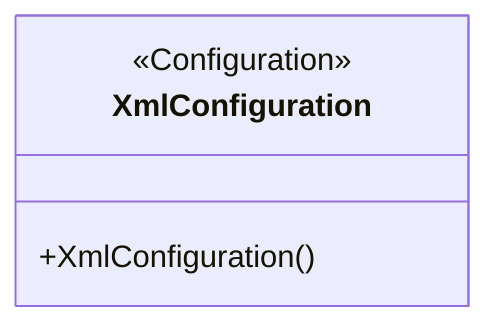
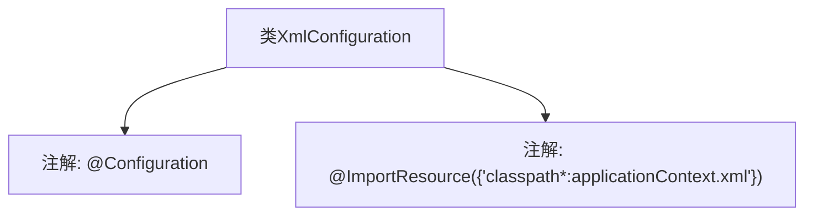

# 基础信息

|      |      |
|------|------|
| 名称 | XmlConfiguration |
| 编码语言 | .java |
| 代码路径 | spring-boot-examples/spring-boot-tutorial-basics/src/main/java/com/in28minutes/springboot/tutorial/basics/example/application/context/java/XmlConfiguration.java |
| 包名 | com.in28minutes.springboot.tutorial.basics.example.application.context.java |
| 依赖项 | ['org.springframework.context.annotation.Configuration', 'org.springframework.context.annotation.ImportResource'] |
| 概述说明 | XmlConfiguration类通过@ImportResource导入applicationContext.xml配置文件。 |

# 说明

XmlConfiguration类通过使用@ImportResource注解，导入了名为applicationContext.xml的配置文件。这一操作使得在Spring框架中，能够将外部XML配置文件中的Bean定义加载到当前的应用上下文中，从而实现配置的集中管理和模块化。这种方式适用于需要将传统的XML配置与基于注解的配置结合使用的场景，确保配置的灵活性和可维护性。

# 类列表 Class Summary

| 名称   | 类型  | 说明 |
|-------|------|-------------|
| XmlConfiguration | class | XmlConfiguration类通过@ImportResource导入applicationContext.xml配置文件。 |

## 类 XmlConfiguration

|      |      |
|------|------|
| 访问范围 | @Configuration;@ImportResource({"classpath*:applicationContext.xml"});public |
| 类型 | class |
| 名称 | XmlConfiguration |
| 说明 | XmlConfiguration类通过@ImportResource导入applicationContext.xml配置文件。 |

### UML类图

这段代码定义了一个名为 `XmlConfiguration` 的类，该类使用了 `@Configuration` 注解，表明它是一个配置类，用于定义和配置 Spring 应用上下文中的 Bean。同时，`@ImportResource` 注解用于导入外部的 XML 配置文件（`applicationContext.xml`），以便在 Spring 应用上下文中使用这些配置。这个类的主要作用是集中管理和加载 XML 配置文件中的 Bean 定义，简化 Spring 应用的配置过程。

### 内部方法调用关系图

这段代码定义了一个名为`XmlConfiguration`的类，该类使用了`@Configuration`注解，表明它是一个配置类。同时，该类还使用了`@ImportResource`注解，指定了要导入的XML配置文件路径为`classpath*:applicationContext.xml`。这段代码的作用是配置Spring应用上下文，通过加载指定的XML配置文件来定义和管理Bean。

### 字段列表 Field List

| 名称  | 类型  | 说明 |
|-------|-------|------|

### 方法列表 Method List

| 名称  | 类型  | 说明 |
|-------|-------|------|

