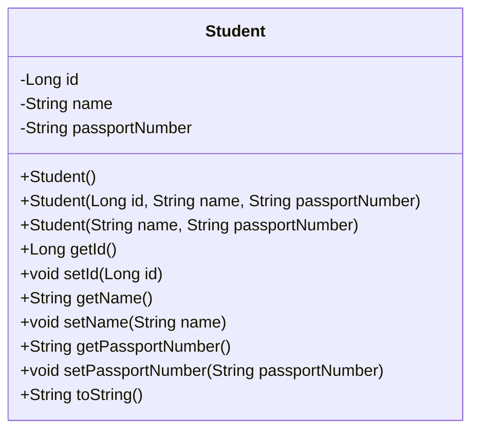

# 基础信息

|      |      |
|------|------|
| 名称 | Student |
| 编码语言 | .java |
| 代码路径 | spring-boot-examples/spring-boot-tutorial-basics/src/main/java/com/in28minutes/springboot/tutorial/basics/example/student/Student.java |
| 包名 | com.in28minutes.springboot.tutorial.basics.example.student |
| 依赖项 | ['jakarta.persistence.Entity', 'jakarta.persistence.GeneratedValue', 'jakarta.persistence.Id'] |
| 概述说明 | 学生类包含ID、姓名、护照号，提供构造方法和访问器。 |

# 说明

学生类是一个用于表示学生信息的类，包含三个主要属性：ID、姓名和护照号。该类提供了构造方法，用于在创建对象时初始化这些属性。此外，学生类还提供了访问器方法，用于获取和设置这些属性的值。构造方法允许在实例化对象时直接传入ID、姓名和护照号，而访问器方法则提供了对这些属性的读取和修改功能。通过这些方法，可以方便地管理和操作学生对象的相关信息。

# 类列表 Class Summary

| 名称   | 类型  | 说明 |
|-------|------|-------------|
| Student | class | 学生类包含ID、姓名和护照号，提供构造方法和访问器。 |

## 类 Student

|      |      |
|------|------|
| 访问范围 | @Entity;public |
| 类型 | class |
| 名称 | Student |
| 说明 | 学生类包含ID、姓名和护照号，提供构造方法和访问器。 |

### UML类图

这段代码定义了一个名为 `Student` 的实体类，用于表示学生的信息。该类包含三个私有属性：`id`、`name` 和 `passportNumber`，分别表示学生的唯一标识、姓名和护照号码。类中提供了多个构造函数，包括默认构造函数和带参数的构造函数，用于初始化对象。此外，类中还提供了获取和设置这些属性的方法，并重写了 `toString` 方法，以便以字符串形式返回学生的详细信息。

### 内部方法调用关系图

```mermaid
graph TD
    A["类Student"]
    B["属性: Long id"]
    C["属性: String name"]
    D["属性: String passportNumber"]
    E["无参构造方法: Student()"]
    F["带参构造方法: Student(Long id, String name, String passportNumber)"]
    G["带参构造方法: Student(String name, String passportNumber)"]
    H["方法: Long getId()"]
    I["方法: void setId(Long id)"]
    J["方法: String getName()"]
    K["方法: void setName(String name)"]
    L["方法: String getPassportNumber()"]
    M["方法: void setPassportNumber(String passportNumber)"]
    N["重写方法: String toString()"]

    A --> B
    A --> C
    A --> D
    A --> E
    A --> F
    A --> G
    A --> H
    A --> I
    A --> J
    A --> K
    A --> L
    A --> M
    A --> N
```

这段代码定义了一个名为`Student`的实体类，包含三个属性：`id`、`name`和`passportNumber`。类中提供了三个构造方法，分别用于不同场景下的对象初始化。此外，类中还定义了获取和设置这些属性的方法，并重写了`toString`方法，以便以特定格式返回对象的字符串表示。该类的设计主要用于管理学生的基本信息，并支持通过不同方式创建和操作学生对象。

### 字段列表 Field List

| 名称  | 类型  | 说明 |
|-------|-------|------|
| id | Long | 定义自动生成的唯一标识符ID。 |
| passportNumber | String | 定义私有字符串变量passportNumber。 |
| name | String | 声明一个私有字符串变量name。 |

### 方法列表 Method List

| 名称  | 类型  | 说明 |
|-------|-------|------|
| getPassportNumber | String | 获取护照号码的方法。 |
| getName | String | 该方法返回字符串类型的变量name。 |
| setName | void | 该方法用于设置对象的名称属性。 |
| setId | void | 设置对象ID的方法。 |
| toString | String | 重写toString方法，返回学生ID、姓名和护照号的格式化字符串。 |
| getId | Long | 获取对象的唯一标识符ID。 |
| setPassportNumber | void | 设置护照号码的方法，将输入值赋给类变量。 |

