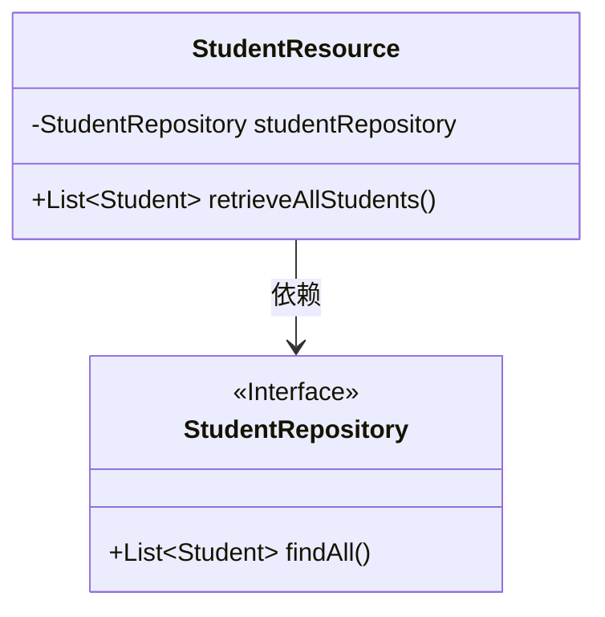
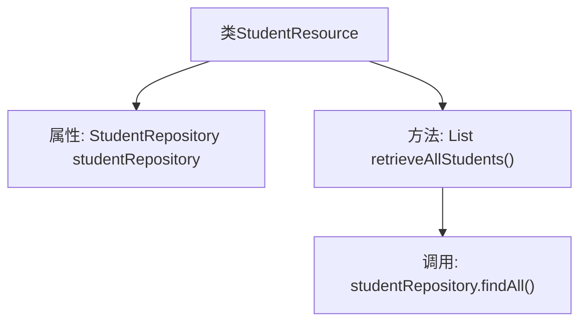

# 基础信息

|      |      |
|------|------|
| 名称 | StudentResource |
| 编码语言 | .java |
| 代码路径 | spring-boot-examples/spring-boot-tutorial-basics/src/main/java/com/in28minutes/springboot/tutorial/basics/example/student/StudentResource.java |
| 包名 | com.in28minutes.springboot.tutorial.basics.example.student |
| 依赖项 | ['java.util.List', 'org.springframework.beans.factory.annotation.Autowired', 'org.springframework.web.bind.annotation.GetMapping', 'org.springframework.web.bind.annotation.RestController'] |
| 概述说明 | Spring Boot控制器StudentResource通过GET请求获取全部学生信息。 |

# 说明

Spring Boot控制器类StudentResource通过GET请求获取所有学生信息。该控制器类负责处理与学生相关的HTTP请求，具体而言，它提供了一个GET请求的端点，用于获取系统中所有学生的信息。通过这个端点，客户端可以请求并接收学生数据的完整列表，从而实现对学生信息的查询和展示功能。

# 类列表 Class Summary

| 名称   | 类型  | 说明 |
|-------|------|-------------|
| StudentResource | class | Spring Boot控制器类StudentResource通过GET请求获取所有学生信息。 |

## 类 StudentResource

|      |      |
|------|------|
| 访问范围 | @RestController;public |
| 类型 | class |
| 名称 | StudentResource |
| 说明 | Spring Boot控制器类StudentResource通过GET请求获取所有学生信息。 |

### UML类图

**描述：**  
`StudentResource` 类是一个 REST 控制器，依赖于 `StudentRepository` 接口来获取学生数据。`StudentRepository` 是一个接口，定义了 `findAll()` 方法，用于返回所有学生的列表。`StudentResource` 类通过 `retrieveAllStudents()` 方法调用 `studentRepository.findAll()` 来获取并返回学生列表。

### 内部方法调用关系图

这段代码是一个Spring Boot的REST控制器类，名为`StudentResource`。它通过`@Autowired`注解注入了一个`StudentRepository`实例，用于访问数据库中的学生数据。`retrieveAllStudents`方法通过`@GetMapping`注解映射到`/students`路径，调用`studentRepository.findAll()`方法获取所有学生数据并返回。该控制器的主要作用是提供一个RESTful API接口，用于获取所有学生信息。

### 字段列表 Field List

| 名称  | 类型  | 说明 |
|-------|-------|------|
| studentRepository | StudentRepository | 自动注入学生仓库实例。 |

### 方法列表 Method List

| 名称  | 类型  | 说明 |
|-------|-------|------|
| retrieveAllStudents | List<Student> | GET请求映射获取所有学生列表。 |

