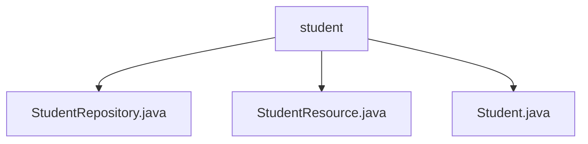

# 基础信息

|      |      |
|------|------|
| 名称 | student |
| 编码语言 | .java |
| 代码路径 | spring-boot-examples/spring-boot-tutorial-basics/src/main/java/com/in28minutes/springboot/tutorial/basics/example/student |
| 包名 | spring-boot-examples.spring-boot-tutorial-basics.src.main.java.com.in28minutes.springboot.tutorial.basics.example.student |
| 概述说明 | Spring Boot控制器类StudentResource通过GET请求获取所有学生信息。学生类包含ID、姓名和护照号属性，提供构造方法和访问器方法。 |

# 说明

## 概述
该代码模块是一个基于Spring Boot的学生信息管理系统，主要用于处理与学生相关的数据操作和HTTP请求。模块包含三个核心类：`Student`、`StudentRepository`和`StudentResource`。`Student`类用于表示学生信息，包含ID、姓名和护照号等属性；`StudentRepository`负责学生数据的持久化操作；`StudentResource`则是一个控制器类，通过HTTP请求提供学生信息的查询功能。

## 主要业务场景
1. **学生信息管理**：通过`Student`类，系统能够创建和管理学生对象，包括初始化学生信息（ID、姓名、护照号）以及通过访问器方法获取或修改这些信息。
2. **数据持久化**：`StudentRepository`类负责学生数据的存储和检索，为系统提供数据持久化支持。
3. **HTTP请求处理**：`StudentResource`控制器类处理与学生相关的HTTP请求，特别是通过GET请求获取所有学生信息的功能，客户端可以通过该端点查询并展示学生数据的完整列表。

### 包内部结构视图

该流程图展示了`student`目录下的三个文件：`StudentRepository.java`、`StudentResource.java`和`Student.java`。`student`作为父节点，直接包含了这三个子节点，清晰地反映了它们在项目中的层级关系。

# 文件列表 File List

| 名称   | 类型  | 说明 |
|-------|------|-------------|
| [Student.java](Student.md) | file | 学生类包含ID、姓名、护照号，提供构造方法和访问器。 |
| [StudentRepository.java](StudentRepository.md) | file | 信息为空，无法生成概要描述。 |
| [StudentResource.java](StudentResource.md) | file | Spring Boot控制器StudentResource通过GET请求获取全部学生信息。 |

