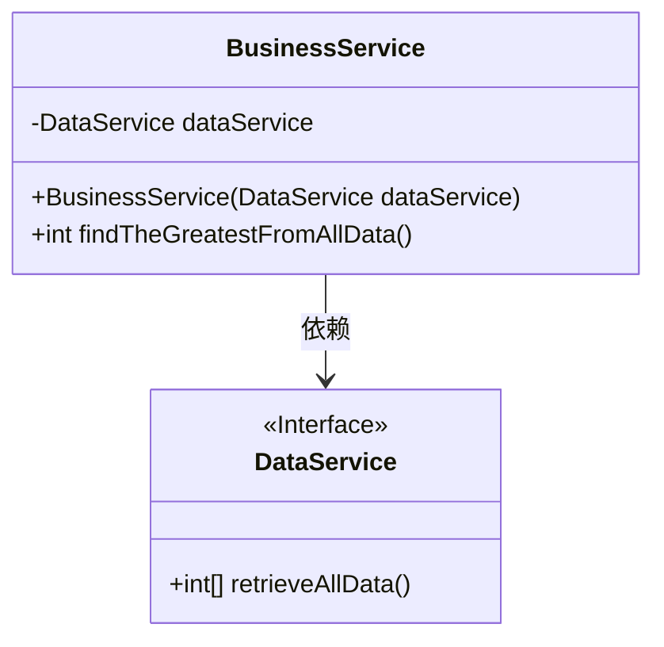
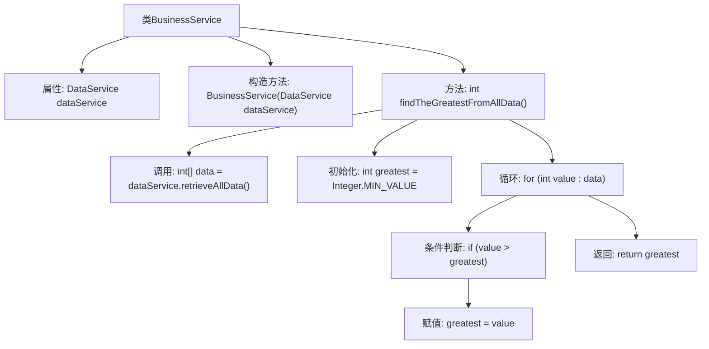

# 基础信息

|      |      |
|------|------|
| 名称 | BusinessService |
| 编码语言 | .java |
| 代码路径 | spring-boot-examples/spring-boot-tutorial-basics/src/main/java/com/in28minutes/springboot/tutorial/basics/example/unittesting/BusinessService.java |
| 包名 | com.in28minutes.springboot.tutorial.basics.example.unittesting |
| 依赖项 | ['org.springframework.stereotype.Service'] |
| 概述说明 | 业务服务类通过数据服务获取数据并返回最大值。 |

# 说明

业务服务类通过调用数据服务获取相关数据，并从中筛选出最大值进行返回。该过程涉及数据服务的调用和数据处理的逻辑，确保最终返回的结果是数据集中的最大值。这一功能适用于需要从大量数据中提取关键信息的场景，提高了数据处理的效率和准确性。

# 类列表 Class Summary

| 名称   | 类型  | 说明 |
|-------|------|-------------|
| BusinessService | class | 业务服务类通过数据服务获取数据并返回最大值。 |

## 类 BusinessService

|      |      |
|------|------|
| 访问范围 | @Service;public |
| 类型 | class |
| 名称 | BusinessService |
| 说明 | 业务服务类通过数据服务获取数据并返回最大值。 |

### UML类图

**描述：**  
`BusinessService`类依赖于`DataService`接口，通过构造函数注入`DataService`实例。`BusinessService`提供了一个公有方法`findTheGreatestFromAllData`，该方法调用`DataService`的`retrieveAllData`方法获取数据数组，并从中找出最大值返回。`DataService`是一个接口，定义了`retrieveAllData`方法，具体的实现类未在代码中显示。

### 内部方法调用关系图

这段代码定义了一个`BusinessService`类，该类依赖于`DataService`来获取数据。`findTheGreatestFromAllData`方法从`DataService`中检索所有数据，并找出其中的最大值。流程图展示了从类定义到方法执行的完整流程，包括数据检索、初始化、循环遍历、条件判断和最终返回最大值的步骤。

### 字段列表 Field List

| 名称  | 类型  | 说明 |
|-------|-------|------|
| dataService | DataService | 私有且不可变的DataService实例。 |

### 方法列表 Method List

| 名称  | 类型  | 说明 |
|-------|-------|------|
| findTheGreatestFromAllData | int | 方法从数据服务获取所有数据并返回最大值。 |

