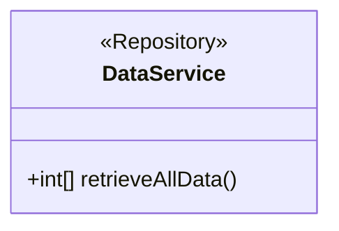
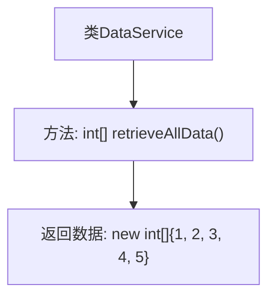

# 基础信息

|      |      |
|------|------|
| 名称 | DataService |
| 编码语言 | .java |
| 代码路径 | spring-boot-examples/spring-boot-tutorial-basics/src/main/java/com/in28minutes/springboot/tutorial/basics/example/unittesting/DataService.java |
| 包名 | com.in28minutes.springboot.tutorial.basics.example.unittesting |
| 依赖项 | ['org.springframework.stereotype.Repository'] |
| 概述说明 | DataService类的retrieveAllData方法返回模拟数据数组。 |

# 说明

DataService类包含一个名为retrieveAllData的方法，该方法用于返回一个模拟数据数组。这个方法的主要功能是获取并返回一组模拟数据，供其他部分调用和使用。通过这种方式，DataService类提供了一个便捷的接口来访问和处理模拟数据。

# 类列表 Class Summary

| 名称   | 类型  | 说明 |
|-------|------|-------------|
| DataService | class | DataService类提供retrieveAllData方法，返回模拟数据数组。 |

## 类 DataService

|      |      |
|------|------|
| 访问范围 | @Repository;public |
| 类型 | class |
| 名称 | DataService |
| 说明 | DataService类提供retrieveAllData方法，返回模拟数据数组。 |

### UML类图

类图描述：  
`DataService` 类被标记为 `@Repository`，表示它是一个数据访问层的组件，通常用于与数据库进行交互。该类包含一个公有方法 `retrieveAllData()`，该方法返回一个整数数组。虽然当前方法返回的是模拟数据，但实际应用中，该方法应负责从数据库中检索所有数据。

### 内部方法调用关系图

这段代码定义了一个名为 `DataService` 的类，其中包含一个 `retrieveAllData` 方法。该方法返回一个包含整数的数组 `{1, 2, 3, 4, 5}`，模拟从数据库中获取数据的操作。虽然代码中没有实际与数据库交互的逻辑，但该方法的设计意图是用于检索所有数据。

### 字段列表 Field List

| 名称  | 类型  | 说明 |
|-------|-------|------|

### 方法列表 Method List

| 名称  | 类型  | 说明 |
|-------|-------|------|
| retrieveAllData | int[] | 方法返回模拟数据数组，应连接数据库获取实际数据。 |

