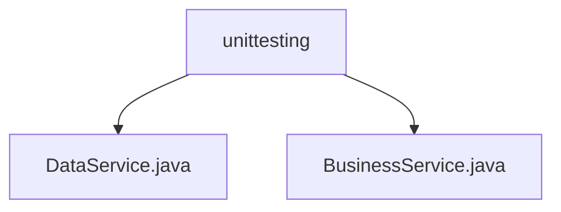

# 基础信息

|      |      |
|------|------|
| 名称 | unittesting |
| 编码语言 | .java |
| 代码路径 | spring-boot-examples/spring-boot-tutorial-basics/src/main/java/com/in28minutes/springboot/tutorial/basics/example/unittesting |
| 包名 | spring-boot-examples.spring-boot-tutorial-basics.src.main.java.com.in28minutes.springboot.tutorial.basics.example.unittesting |
| 概述说明 | DataService类提供模拟数据，BusinessService类筛选并返回最大值。 |

# 说明

## 概述

该代码模块主要包含两个类：`DataService` 和 `BusinessService`。`DataService` 类提供了一个名为 `retrieveAllData` 的方法，用于返回一组模拟数据。`BusinessService` 类则通过调用 `DataService` 获取数据，并从中筛选出最大值进行返回。该模块的核心功能是提供数据访问和数据处理的能力，适用于需要从大量数据中提取关键信息的场景。

## 主要业务场景

1. **数据获取**：`DataService` 类的 `retrieveAllData` 方法用于获取并返回一组模拟数据。该方法为其他部分提供了一个便捷的接口来访问和处理模拟数据。

2. **数据处理**：`BusinessService` 类通过调用 `DataService` 获取数据，并从中筛选出最大值进行返回。这一过程涉及数据服务的调用和数据处理的逻辑，确保最终返回的结果是数据集中的最大值。

3. **关键信息提取**：该模块适用于需要从大量数据中提取关键信息的场景，提高了数据处理的效率和准确性。例如，在需要从一组数据中找出最大值的业务场景中，`BusinessService` 类可以快速准确地完成这一任务。

### 包内部结构视图

该流程图展示了 `unittesting` 文件夹下的两个文件 `DataService.java` 和 `BusinessService.java` 的层级关系。`unittesting` 作为父节点，直接包含这两个文件，清晰地反映了文件在项目中的组织结构。

# 文件列表 File List

| 名称   | 类型  | 说明 |
|-------|------|-------------|
| [DataService.java](DataService.md) | file | DataService类的retrieveAllData方法返回模拟数据数组。 |
| [BusinessService.java](BusinessService.md) | file | 业务服务类通过数据服务获取数据并返回最大值。 |

