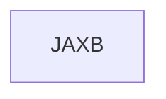

# 基础信息

|      |      |
|------|------|
| 名称 | JAXB |
| 编码语言 | .java |
| 代码路径 | spring-boot-examples/spring-boot-tutorial-soap-web-services/src/main/java/META-INF/JAXB |
| 包名 | spring-boot-examples.spring-boot-tutorial-soap-web-services.src.main.java.META-INF.JAXB |
| 概述说明 | None |

# 说明

None

### 包内部结构视图

描述：该流程图展示了路径的层级关系，路径的最后一级元素为“JAXB”，表示这是一个独立的节点，没有进一步的子节点或文件。

# 文件列表 File List

| 名称   | 类型  | 说明 |
|-------|------|-------------|

