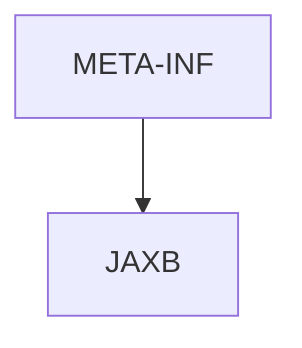

# 基础信息

|      |      |
|------|------|
| 名称 | META-INF |
| 编码语言 | .java |
| 代码路径 | spring-boot-examples/spring-boot-tutorial-soap-web-services/src/main/java/META-INF |
| 包名 | spring-boot-examples.spring-boot-tutorial-soap-web-services.src.main.java.META-INF |
| 概述说明 | None |

# 说明

None

### 包内部结构视图

该流程图展示了`META-INF`文件夹与其子文件夹`JAXB`之间的层级关系。`META-INF`是根节点，`JAXB`是其直接子节点，表示`JAXB`文件夹位于`META-INF`文件夹内。这种结构常见于Java项目中的资源文件夹，用于存放与JAXB相关的配置文件或元数据。

# 文件列表 File List

| 名称   | 类型  | 说明 |
|-------|------|-------------|
| [JAXB](JAXB/_module.md) | package | None |

