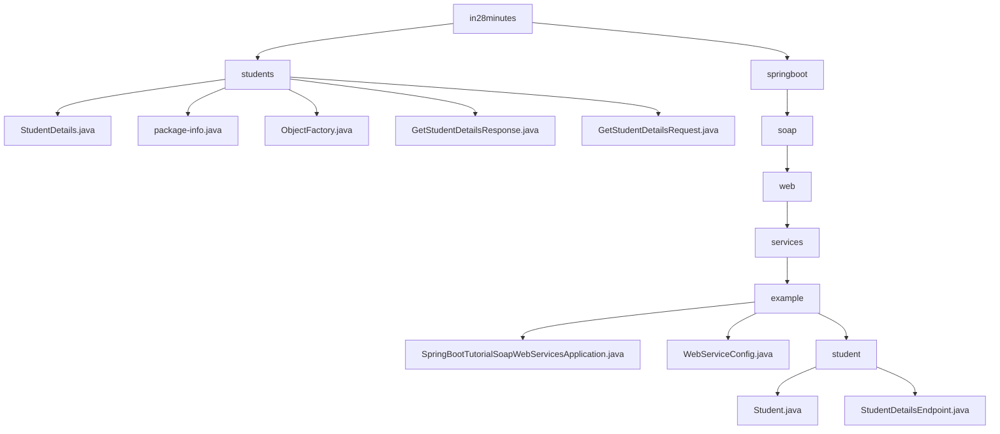

# 基础信息

|      |      |
|------|------|
| 名称 | in28minutes |
| 编码语言 | .java |
| 代码路径 | spring-boot-examples/spring-boot-tutorial-soap-web-services/src/main/java/com/in28minutes |
| 包名 | spring-boot-examples.spring-boot-tutorial-soap-web-services.src.main.java.com.in28minutes |
| 概述说明 | Spring Boot SOAP Web服务模块，管理学生信息，支持查询、存储和响应。 |

# 说明

## 概述
该代码模块是一个基于Spring Boot的SOAP Web服务示例，主要用于管理和操作学生的基本信息。模块的核心功能是提供学生信息的查询服务，允许用户通过SOAP协议获取特定学生的基本身份信息，包括学生的ID、姓名和护照号。模块通过定义`Student`类和`StudentDetailsEndpoint`类来实现这一功能。Spring Boot应用启动类作为应用的入口点，负责初始化Spring Boot应用上下文，并配置和启动SOAP Web服务。通过Spring Boot的自动配置机制，简化了SOAP服务的部署和管理，使得开发者能够快速构建和运行基于SOAP协议的Web服务。

## 主要业务场景
1. **学生信息管理**：通过`StudentDetails`类，模块能够存储和管理学生的基本信息，包括学生的唯一标识符（ID）、姓名和护照号码。每个属性都提供了相应的getter和setter方法，方便外部访问和修改。
2. **学生信息查询**：`GetStudentDetailsRequest`类用于接收客户端发送的请求，该请求包含学生的唯一标识符（ID）。通过这个ID，服务端可以定位并返回特定学生的详细信息。
3. **学生信息响应**：`GetStudentDetailsResponse`类用于封装服务端返回的学生详细信息。该类包含一个`StudentDetails`属性，提供了获取和设置该属性的方法，确保数据的封装性和灵活性。
4. **SOAP服务端点**：`StudentDetailsEndpoint`类作为SOAP服务的端点，负责处理用户请求，并返回包含学生详细信息的响应。通过该端点，用户可以方便地获取所需的学生数据，便于进一步的管理和操作。
5. **对象创建与管理**：`ObjectFactory`类作为工厂类，负责创建和管理`com.in28minutes.students`包中的模式派生类实例。通过集中管理对象的创建逻辑，减少了代码的重复性和复杂性，提高了代码的模块化程度。
6. **Web服务配置**：配置Web服务涉及设置服务器环境以支持Web应用程序的运行。注册Servlet是将自定义的Servlet类部署到服务器中，使其能够处理客户端请求。定义WSDL（Web Services Description Language）是为了描述Web服务的接口和操作，使客户端能够了解如何与服务进行交互。定义XSD（XML Schema Definition）则是为了规范Web服务中使用的XML文档的结构和数据类型，确保数据交换的一致性和准确性。这些步骤共同构成了Web服务的核心配置和部署流程。

### 包内部结构视图

该流程图展示了 `in28minutes` 目录下的层级结构，包含 `students` 和 `springboot` 两个主要子目录。`students` 目录下包含多个与学生相关的 Java 文件，而 `springboot` 目录则进一步细分为 `soap`、`web`、`services` 和 `example` 等子目录，最终指向具体的应用配置和端点文件。

# 文件列表 File List

| 名称   | 类型  | 说明 |
|-------|------|-------------|
| [springboot](springboot/_module.md) | package | Spring Boot启动类运行SOAP Web服务，简化部署和管理。 |
| [students](students/_module.md) | package | StudentDetails类管理学生信息，ObjectFactory简化对象创建，GetStudentDetailsResponse处理学生详情，GetStudentDetailsRequest用于获取学生信息。 |

