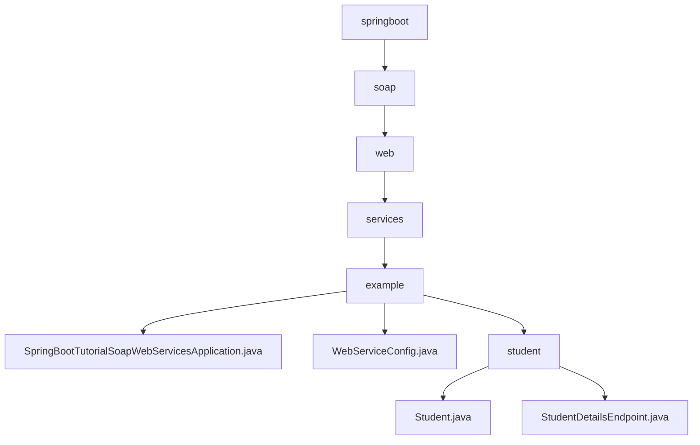

# 基础信息

|      |      |
|------|------|
| 名称 | springboot |
| 编码语言 | .java |
| 代码路径 | spring-boot-examples/spring-boot-tutorial-soap-web-services/src/main/java/com/in28minutes/springboot |
| 包名 | spring-boot-examples.spring-boot-tutorial-soap-web-services.src.main.java.com.in28minutes.springboot |
| 概述说明 | Spring Boot启动类运行SOAP Web服务，简化部署和管理。 |

# 说明

## 概述
该代码模块是一个基于Spring Boot的SOAP Web服务示例，主要用于处理与学生相关的数据请求。模块的核心功能是提供学生信息的查询服务，允许用户通过SOAP协议获取特定学生的基本身份信息，包括学生的ID、姓名和护照号。模块通过定义`Student`类和`StudentDetailsEndpoint`类来实现这一功能。Spring Boot应用启动类作为应用的入口点，负责初始化Spring Boot应用上下文，并配置和启动SOAP Web服务。通过Spring Boot的自动配置机制，简化了SOAP服务的部署和管理，使得开发者能够快速构建和运行基于SOAP协议的Web服务。

## 主要业务场景
1. **学生信息管理**：模块允许用户通过SOAP Web服务查询特定学生的详细信息。用户可以通过请求获取学生的ID、姓名和护照号等关键信息，确保数据的准确性和完整性。
2. **数据访问与修改**：`Student`类定义了学生的基本属性，并提供了相应的getter和setter方法，便于在需要时访问和修改这些属性的值。
3. **SOAP服务端点**：`StudentDetailsEndpoint`类作为SOAP服务的端点，负责处理用户请求，并返回包含学生详细信息的响应。通过该端点，用户可以方便地获取所需的学生数据，便于进一步的管理和操作。
4. **Web服务配置**：配置Web服务涉及设置服务器环境以支持Web应用程序的运行。注册Servlet是将自定义的Servlet类部署到服务器中，使其能够处理客户端请求。定义WSDL（Web Services Description Language）是为了描述Web服务的接口和操作，使客户端能够了解如何与服务进行交互。定义XSD（XML Schema Definition）则是为了规范Web服务中使用的XML文档的结构和数据类型，确保数据交换的一致性和准确性。这些步骤共同构成了Web服务的核心配置和部署流程。

### 包内部结构视图

该流程图展示了从`springboot`到`student`目录的层级关系，最终指向多个Java文件。每个节点代表路径的最后一级元素，清晰地展示了文件与文件夹之间的从属关系。

# 文件列表 File List

| 名称   | 类型  | 说明 |
|-------|------|-------------|
| [soap](soap/_module.md) | package | Spring Boot启动类运行SOAP Web服务，简化部署和管理。 |

