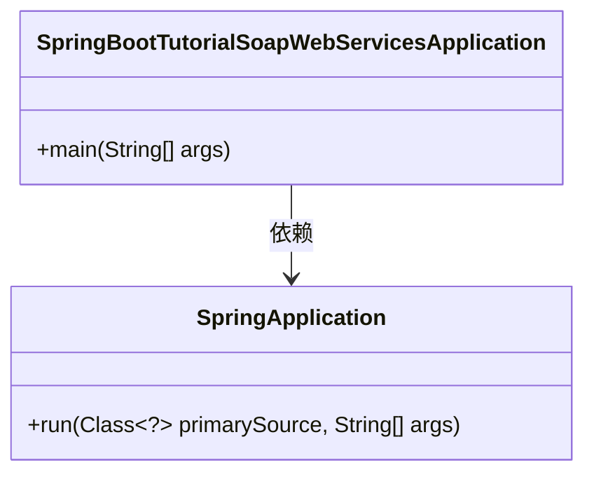
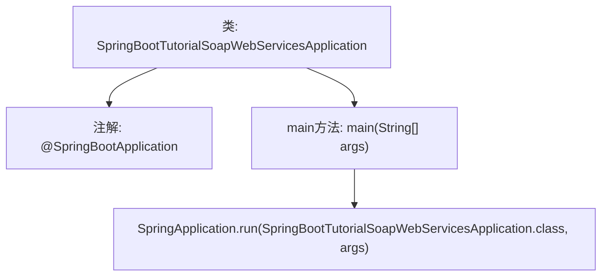

# 基础信息

|      |      |
|------|------|
| 名称 | SpringBootTutorialSoapWebServicesApplication |
| 编码语言 | .java |
| 代码路径 | spring-boot-examples/spring-boot-tutorial-soap-web-services/src/main/java/com/in28minutes/springboot/soap/web/services/example/SpringBootTutorialSoapWebServicesApplication.java |
| 包名 | com.in28minutes.springboot.soap.web.services.example |
| 依赖项 | ['org.springframework.boot.SpringApplication', 'org.springframework.boot.autoconfigure.SpringBootApplication'] |
| 概述说明 | Spring Boot启动类，运行SOAP Web服务。 |

# 说明

Spring Boot应用启动类的主要功能是运行SOAP Web服务。该类作为应用的入口点，负责初始化Spring Boot应用上下文，并配置和启动SOAP Web服务。通过Spring Boot的自动配置机制，简化了SOAP服务的部署和管理，使得开发者能够快速构建和运行基于SOAP协议的Web服务。

# 类列表 Class Summary

| 名称   | 类型  | 说明 |
|-------|------|-------------|
| SpringBootTutorialSoapWebServicesApplication | class | Spring Boot应用启动类，运行SOAP Web服务。 |

## 类 SpringBootTutorialSoapWebServicesApplication

|      |      |
|------|------|
| 访问范围 | @SpringBootApplication;public |
| 类型 | class |
| 名称 | SpringBootTutorialSoapWebServicesApplication |
| 说明 | Spring Boot应用启动类，运行SOAP Web服务。 |

### UML类图

这段代码定义了一个Spring Boot应用程序的入口类 `SpringBootTutorialSoapWebServicesApplication`，其中包含一个 `main` 方法，用于启动Spring Boot应用。`SpringApplication` 类提供了 `run` 方法，用于启动Spring Boot应用程序。`SpringBootTutorialSoapWebServicesApplication` 类依赖于 `SpringApplication` 类来执行应用程序的启动逻辑。

### 内部方法调用关系图

该流程图展示了`SpringBootTutorialSoapWebServicesApplication`类的结构及其主要功能。类被标记为`@SpringBootApplication`，表示这是一个Spring Boot应用程序的入口类。`main`方法是程序的启动点，调用`SpringApplication.run`方法来启动Spring Boot应用。此流程图简洁地描述了Spring Boot应用的启动流程。

### 字段列表 Field List

| 名称  | 类型  | 说明 |
|-------|-------|------|

### 方法列表 Method List

| 名称  | 类型  | 说明 |
|-------|-------|------|
| main | void | Spring Boot启动SOAP Web服务应用的主方法。 |

