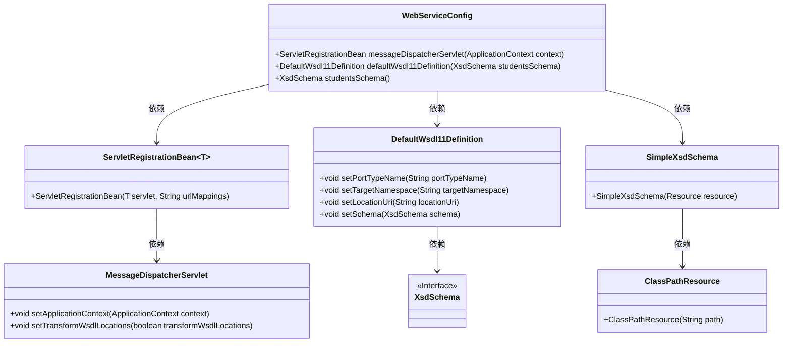
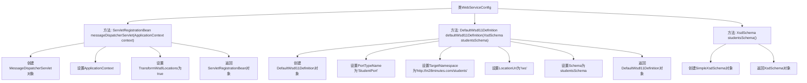

# 基础信息

|      |      |
|------|------|
| 名称 | WebServiceConfig |
| 编码语言 | .java |
| 代码路径 | spring-boot-examples/spring-boot-tutorial-soap-web-services/src/main/java/com/in28minutes/springboot/soap/web/services/example/WebServiceConfig.java |
| 包名 | com.in28minutes.springboot.soap.web.services.example |
| 依赖项 | ['org.springframework.boot.web.servlet.ServletRegistrationBean', 'org.springframework.context.ApplicationContext', 'org.springframework.context.annotation.Bean', 'org.springframework.context.annotation.Configuration', 'org.springframework.core.io.ClassPathResource', 'org.springframework.ws.config.annotation.EnableWs', 'org.springframework.ws.transport.http.MessageDispatcherServlet', 'org.springframework.ws.wsdl.wsdl11.DefaultWsdl11Definition', 'org.springframework.xml.xsd.SimpleXsdSchema', 'org.springframework.xml.xsd.XsdSchema'] |
| 概述说明 | 配置Web服务，注册Servlet，定义WSDL和XSD。 |

# 说明

配置Web服务涉及设置服务器环境以支持Web应用程序的运行。注册Servlet是将自定义的Servlet类部署到服务器中，使其能够处理客户端请求。定义WSDL（Web Services Description Language）是为了描述Web服务的接口和操作，使客户端能够了解如何与服务进行交互。定义XSD（XML Schema Definition）则是为了规范Web服务中使用的XML文档的结构和数据类型，确保数据交换的一致性和准确性。这些步骤共同构成了Web服务的核心配置和部署流程。

# 类列表 Class Summary

| 名称   | 类型  | 说明 |
|-------|------|-------------|
| WebServiceConfig | class | 配置Web服务，注册Servlet，定义WSDL和XSD。 |

## 类 WebServiceConfig

|      |      |
|------|------|
| 访问范围 | @EnableWs;@Configuration;public |
| 类型 | class |
| 名称 | WebServiceConfig |
| 说明 | 配置Web服务，注册Servlet，定义WSDL和XSD。 |

### UML类图

**描述：**
`WebServiceConfig` 类是一个配置类，用于配置Web服务相关的Bean。它定义了三个Bean：`messageDispatcherServlet` 用于注册消息分发Servlet，`defaultWsdl11Definition` 用于定义WSDL服务，`studentsSchema` 用于加载XSD模式文件。`ServletRegistrationBean` 类用于注册Servlet，`MessageDispatcherServlet` 是Spring的Servlet实现，`DefaultWsdl11Definition` 用于定义WSDL服务，`XsdSchema` 是一个接口，`SimpleXsdSchema` 是其实现类，`ClassPathResource` 用于加载类路径资源。

### 内部方法调用关系图

这段代码定义了一个Spring配置类`WebServiceConfig`，用于配置Web服务。`messageDispatcherServlet`方法创建并配置了一个`MessageDispatcherServlet`，并将其注册到`/ws/*`路径。`defaultWsdl11Definition`方法定义了一个WSDL服务，设置了端口类型、命名空间、位置URI和Schema。`studentsSchema`方法加载并返回了一个XSD Schema文件。整个配置类用于启动和配置基于Spring的Web服务。

### 字段列表 Field List

| 名称  | 类型  | 说明 |
|-------|-------|------|

### 方法列表 Method List

| 名称  | 类型  | 说明 |
|-------|-------|------|
| messageDispatcherServlet | ServletRegistrationBean<?> | 创建Servlet注册Bean，配置消息分发Servlet并设置上下文和WSDL位置转换。 |
| studentsSchema | XsdSchema | 定义了一个名为studentsSchema的Bean，返回基于student-details.xsd的XsdSchema实例。 |
| defaultWsdl11Definition | DefaultWsdl11Definition | 创建名为"students"的Bean，定义WSDL端口类型、命名空间、位置URI及模式。 |

