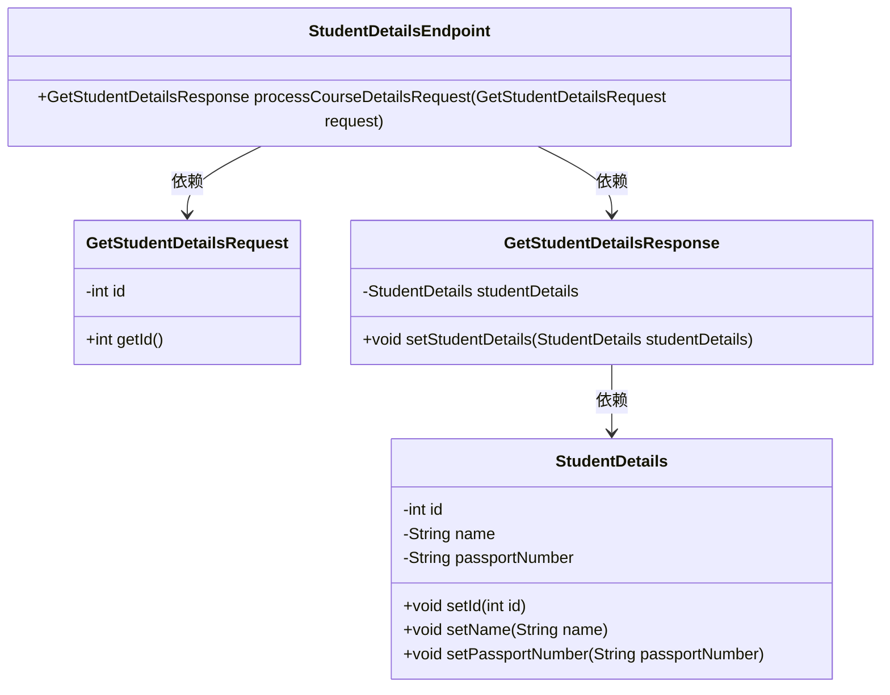
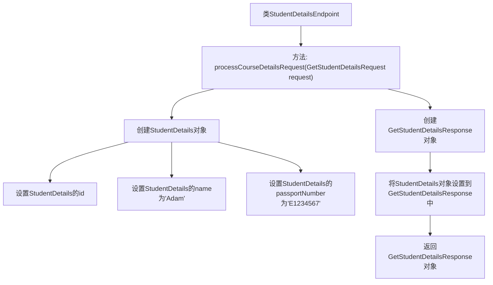

# 基础信息

|      |      |
|------|------|
| 名称 | StudentDetailsEndpoint |
| 编码语言 | .java |
| 代码路径 | spring-boot-examples/spring-boot-tutorial-soap-web-services/src/main/java/com/in28minutes/springboot/soap/web/services/example/student/StudentDetailsEndpoint.java |
| 包名 | com.in28minutes.springboot.soap.web.services.example.student |
| 依赖项 | ['com.in28minutes.students.GetStudentDetailsRequest', 'com.in28minutes.students.GetStudentDetailsResponse', 'com.in28minutes.students.StudentDetails', 'org.springframework.ws.server.endpoint.annotation.Endpoint', 'org.springframework.ws.server.endpoint.annotation.PayloadRoot', 'org.springframework.ws.server.endpoint.annotation.RequestPayload', 'org.springframework.ws.server.endpoint.annotation.ResponsePayload'] |
| 概述说明 | 处理学生请求，返回ID、姓名及护照号信息。 |

# 说明

该功能用于处理学生详情请求，并返回包含学生ID、姓名和护照号等关键信息的响应。通过该功能，用户可以获取特定学生的基本身份信息，确保数据的准确性和完整性，便于进一步的管理和操作。

# 类列表 Class Summary

| 名称   | 类型  | 说明 |
|-------|------|-------------|
| StudentDetailsEndpoint | class | 处理学生详情请求，返回包含ID、姓名和护照号的响应。 |

## 类 StudentDetailsEndpoint

|      |      |
|------|------|
| 访问范围 | @Endpoint;public |
| 类型 | class |
| 名称 | StudentDetailsEndpoint |
| 说明 | 处理学生详情请求，返回包含ID、姓名和护照号的响应。 |

### UML类图

这段代码描述了一个名为 `StudentDetailsEndpoint` 的类，它通过 `processCourseDetailsRequest` 方法处理 `GetStudentDetailsRequest` 请求，并返回 `GetStudentDetailsResponse` 响应。`GetStudentDetailsResponse` 包含一个 `StudentDetails` 对象，该对象存储了学生的详细信息。类之间的关系通过依赖箭头表示，`StudentDetailsEndpoint` 依赖于 `GetStudentDetailsRequest` 和 `GetStudentDetailsResponse`，而 `GetStudentDetailsResponse` 又依赖于 `StudentDetails`。

### 内部方法调用关系图

这段代码定义了一个名为`StudentDetailsEndpoint`的类，其中包含一个处理`GetStudentDetailsRequest`请求的方法`processCourseDetailsRequest`。该方法首先创建一个`GetStudentDetailsResponse`对象，然后根据请求中的ID创建一个`StudentDetails`对象，并设置其名称和护照号码。最后，将`StudentDetails`对象设置到响应中并返回。流程图展示了该方法的执行步骤和对象之间的交互关系。

### 字段列表 Field List

| 名称  | 类型  | 说明 |
|-------|-------|------|

### 方法列表 Method List

| 名称  | 类型  | 说明 |
|-------|-------|------|
| processCourseDetailsRequest | GetStudentDetailsResponse | 处理学生详情请求，返回包含ID、姓名和护照号的学生详情响应。 |

