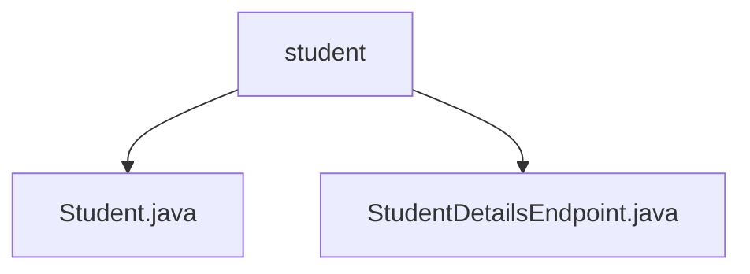

# 基础信息

|      |      |
|------|------|
| 名称 | student |
| 编码语言 | .java |
| 代码路径 | spring-boot-examples/spring-boot-tutorial-soap-web-services/src/main/java/com/in28minutes/springboot/soap/web/services/example/student |
| 包名 | spring-boot-examples.spring-boot-tutorial-soap-web-services.src.main.java.com.in28minutes.springboot.soap.web.services.example.student |
| 概述说明 | Java类Student定义id、name、passportNumber属性，提供构造和访问方法。 |

# 说明

## 概述
该代码模块是一个基于Spring Boot的SOAP Web服务示例，主要用于处理与学生相关的数据请求。模块的核心功能是提供学生信息的查询服务，允许用户通过SOAP协议获取特定学生的基本身份信息，包括学生的ID、姓名和护照号。模块通过定义`Student`类和`StudentDetailsEndpoint`类来实现这一功能。

## 主要业务场景
1. **学生信息管理**：模块允许用户通过SOAP Web服务查询特定学生的详细信息。用户可以通过请求获取学生的ID、姓名和护照号等关键信息，确保数据的准确性和完整性。
2. **数据访问与修改**：`Student`类定义了学生的基本属性，并提供了相应的getter和setter方法，便于在需要时访问和修改这些属性的值。
3. **SOAP服务端点**：`StudentDetailsEndpoint`类作为SOAP服务的端点，负责处理用户请求，并返回包含学生详细信息的响应。通过该端点，用户可以方便地获取所需的学生数据，便于进一步的管理和操作。

### 包内部结构视图

该流程图展示了`student`文件夹下的文件层级关系。`student`作为根节点，包含两个子节点：`Student.java`和`StudentDetailsEndpoint.java`。这些文件属于同一个项目路径，用于处理学生相关的SOAP Web服务逻辑。

# 文件列表 File List

| 名称   | 类型  | 说明 |
|-------|------|-------------|
| [StudentDetailsEndpoint.java](StudentDetailsEndpoint.md) | file | 处理学生请求，返回ID、姓名及护照号信息。 |
| [Student.java](Student.md) | file | Java类Student包含id、name、passportNumber属性及其构造方法和getter/setter。 |

