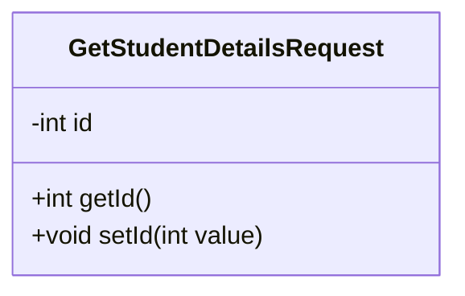
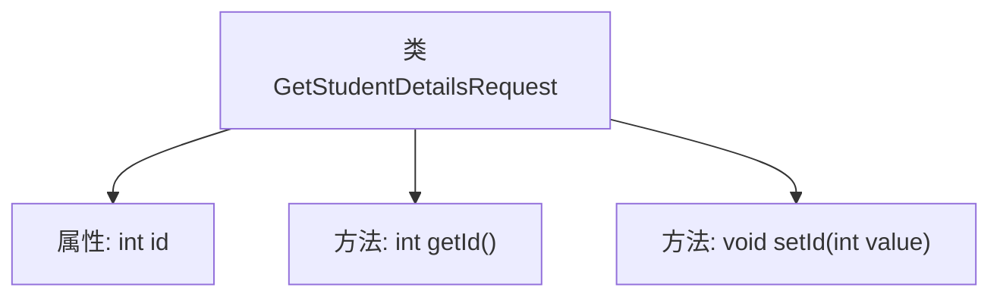

# 基础信息

|      |      |
|------|------|
| 名称 | GetStudentDetailsRequest |
| 编码语言 | .java |
| 代码路径 | spring-boot-examples/spring-boot-tutorial-soap-web-services/src/main/java/com/in28minutes/students/GetStudentDetailsRequest.java |
| 包名 | com.in28minutes.students |
| 依赖项 | ['jakarta.xml.bind.annotation.XmlAccessType', 'jakarta.xml.bind.annotation.XmlAccessorType', 'jakarta.xml.bind.annotation.XmlRootElement', 'jakarta.xml.bind.annotation.XmlType'] |
| 概述说明 | 获取学生详情请求类，包含ID属性及访问方法。 |

# 说明

获取学生详情请求类是一个用于获取学生详细信息的类，主要包含一个ID属性，用于标识特定学生。该类提供了对ID属性的访问方法，包括获取和设置ID值。通过这些方法，可以方便地查询和更新学生的唯一标识符，从而获取或修改学生的详细信息。

# 类列表 Class Summary

| 名称   | 类型  | 说明 |
|-------|------|-------------|
| GetStudentDetailsRequest | class | 获取学生详情请求类，包含ID属性及其访问方法。 |

## 类 GetStudentDetailsRequest

|      |      |
|------|------|
| 访问范围 | @XmlAccessorType(XmlAccessType.FIELD);@XmlType(name = "", propOrder = {;    "id";});@XmlRootElement(name = "GetStudentDetailsRequest");public |
| 类型 | class |
| 名称 | GetStudentDetailsRequest |
| 说明 | 获取学生详情请求类，包含ID属性及其访问方法。 |

### UML类图

这段代码定义了一个名为 `GetStudentDetailsRequest` 的类，该类用于表示获取学生详细信息的请求。类中包含一个私有的 `id` 字段，用于存储学生的唯一标识符。类提供了两个公有方法：`getId()` 用于获取 `id` 的值，`setId(int value)` 用于设置 `id` 的值。该类使用了 `@XmlAccessorType`、`@XmlType` 和 `@XmlRootElement` 注解，表明它是一个用于XML序列化和反序列化的类。

### 内部方法调用关系图

这段代码定义了一个名为 `GetStudentDetailsRequest` 的类，该类用于获取学生详细信息请求。类中包含一个受保护的整型属性 `id`，以及两个方法：`getId()` 用于获取 `id` 的值，`setId(int value)` 用于设置 `id` 的值。类通过注解 `@XmlAccessorType`、`@XmlType` 和 `@XmlRootElement` 来指定 XML 映射的配置。

### 字段列表 Field List

| 名称  | 类型  | 说明 |
|-------|-------|------|
| id | int | 定义了一个受保护的整型变量id。 |

### 方法列表 Method List

| 名称  | 类型  | 说明 |
|-------|-------|------|
| getId | int | 获取对象的ID值。 |
| setId | void | 该方法用于设置对象的ID属性，接受一个整数值作为参数。 |

