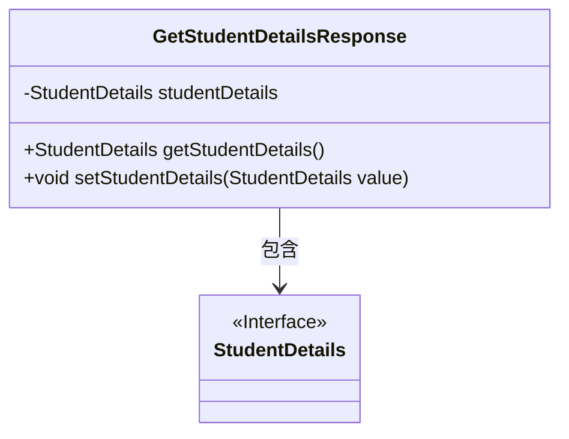
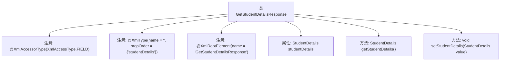

# 基础信息

|      |      |
|------|------|
| 名称 | GetStudentDetailsResponse |
| 编码语言 | .java |
| 代码路径 | spring-boot-examples/spring-boot-tutorial-soap-web-services/src/main/java/com/in28minutes/students/GetStudentDetailsResponse.java |
| 包名 | com.in28minutes.students |
| 依赖项 | ['jakarta.xml.bind.annotation.XmlAccessType', 'jakarta.xml.bind.annotation.XmlAccessorType', 'jakarta.xml.bind.annotation.XmlElement', 'jakarta.xml.bind.annotation.XmlRootElement', 'jakarta.xml.bind.annotation.XmlType'] |
| 概述说明 | GetStudentDetailsResponse类含StudentDetails属性及其getter和setter方法。 |

# 说明

GetStudentDetailsResponse类是一个包含StudentDetails属性的类，该类提供了获取和设置StudentDetails属性的方法。通过getter方法可以访问StudentDetails属性的值，而setter方法则用于设置或更新该属性的值。这种设计使得StudentDetails属性在类外部可以被安全地访问和修改，确保了数据的封装性和灵活性。

# 类列表 Class Summary

| 名称   | 类型  | 说明 |
|-------|------|-------------|
| GetStudentDetailsResponse | class | GetStudentDetailsResponse类包含StudentDetails属性及其getter和setter方法。 |

## 类 GetStudentDetailsResponse

|      |      |
|------|------|
| 访问范围 | @XmlAccessorType(XmlAccessType.FIELD);@XmlType(name = "", propOrder = {;    "studentDetails";});@XmlRootElement(name = "GetStudentDetailsResponse");public |
| 类型 | class |
| 名称 | GetStudentDetailsResponse |
| 说明 | GetStudentDetailsResponse类包含StudentDetails属性及其getter和setter方法。 |

### UML类图

这段代码定义了一个名为 `GetStudentDetailsResponse` 的类，该类包含一个 `StudentDetails` 类型的属性 `studentDetails`，并提供了获取和设置该属性的方法。`StudentDetails` 被标记为接口，表示它是一个抽象的数据结构。`GetStudentDetailsResponse` 类依赖于 `StudentDetails` 接口，用于存储和操作学生详细信息。该类的设计主要用于处理与 XML 数据相关的学生信息响应。

### 内部方法调用关系图

这段代码定义了一个名为 `GetStudentDetailsResponse` 的类，用于表示获取学生详细信息的响应。类中使用了多个XML注解来指定类的序列化行为，包括 `@XmlAccessorType`、`@XmlType` 和 `@XmlRootElement`。类中包含一个 `StudentDetails` 类型的属性 `studentDetails`，并提供了 `getStudentDetails` 和 `setStudentDetails` 方法来获取和设置该属性的值。这些方法允许外部代码访问和修改 `studentDetails` 属性。

### 字段列表 Field List

| 名称  | 类型  | 说明 |
|-------|-------|------|
| studentDetails | StudentDetails | XML元素StudentDetails必须存在且包含学生详细信息。 |

### 方法列表 Method List

| 名称  | 类型  | 说明 |
|-------|-------|------|
| getStudentDetails | StudentDetails | 获取学生详细信息的方法。 |
| setStudentDetails | void | 设置学生详细信息的方法。 |

