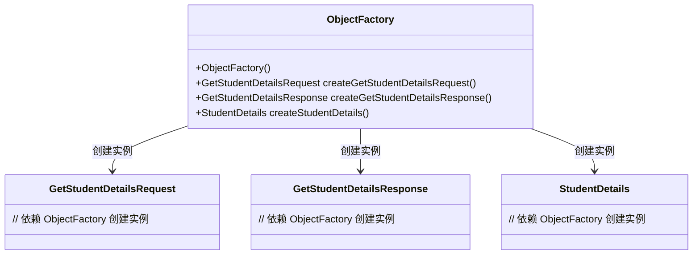
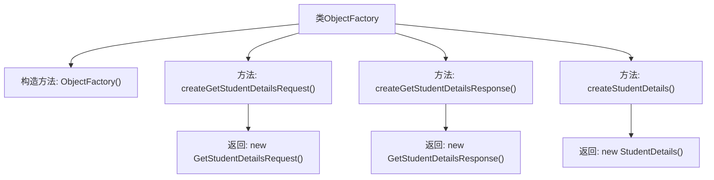

# 基础信息

|      |      |
|------|------|
| 名称 | ObjectFactory |
| 编码语言 | .java |
| 代码路径 | spring-boot-examples/spring-boot-tutorial-soap-web-services/src/main/java/com/in28minutes/students/ObjectFactory.java |
| 包名 | com.in28minutes.students |
| 依赖项 | ['jakarta.xml.bind.annotation.XmlRegistry'] |
| 概述说明 | ObjectFactory类用于创建com.in28minutes.students包中的新实例。 |

# 说明

ObjectFactory类的主要功能是生成com.in28minutes.students包中模式派生类的新实例。它通过提供实例化这些派生类的机制，简化了对象的创建过程，确保代码的模块化和可维护性。该类在应用程序中扮演着工厂模式的角色，集中管理对象的创建逻辑，减少代码的重复性和复杂性。

# 类列表 Class Summary

| 名称   | 类型  | 说明 |
|-------|------|-------------|
| ObjectFactory | class | ObjectFactory类用于创建com.in28minutes.students包中模式派生类的新实例。 |

## 类 ObjectFactory

|      |      |
|------|------|
| 访问范围 | @XmlRegistry;public |
| 类型 | class |
| 名称 | ObjectFactory |
| 说明 | ObjectFactory类用于创建com.in28minutes.students包中模式派生类的新实例。 |

### UML类图

**描述：**  
`ObjectFactory` 类用于创建 `GetStudentDetailsRequest`、`GetStudentDetailsResponse` 和 `StudentDetails` 的实例。通过 `createGetStudentDetailsRequest`、`createGetStudentDetailsResponse` 和 `createStudentDetails` 方法，`ObjectFactory` 分别生成这三个类的对象。类图展示了 `ObjectFactory` 与其他三个类之间的依赖关系，即 `ObjectFactory` 负责创建这些类的实例。

### 内部方法调用关系图

这段代码定义了一个名为`ObjectFactory`的类，用于创建与`com.in28minutes.students`包相关的模式派生类的实例。类中包含一个默认的构造方法和三个工厂方法，分别用于创建`GetStudentDetailsRequest`、`GetStudentDetailsResponse`和`StudentDetails`的实例。每个工厂方法都返回对应类的新实例，从而简化了对象的创建过程。

### 字段列表 Field List

| 名称  | 类型  | 说明 |
|-------|-------|------|

### 方法列表 Method List

| 名称  | 类型  | 说明 |
|-------|-------|------|
| createStudentDetails | StudentDetails | 创建并返回一个StudentDetails对象实例。 |
| createGetStudentDetailsResponse | GetStudentDetailsResponse | 创建返回学生详细信息的响应对象。 |
| createGetStudentDetailsRequest | GetStudentDetailsRequest | 创建并返回GetStudentDetailsRequest对象。 |

