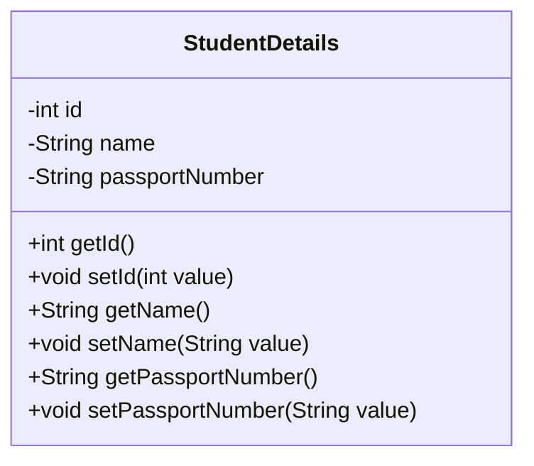
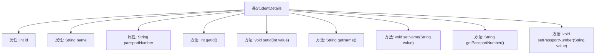

# 基础信息

|      |      |
|------|------|
| 名称 | StudentDetails |
| 编码语言 | .java |
| 代码路径 | spring-boot-examples/spring-boot-tutorial-soap-web-services/src/main/java/com/in28minutes/students/StudentDetails.java |
| 包名 | com.in28minutes.students |
| 依赖项 | ['jakarta.xml.bind.annotation.XmlAccessType', 'jakarta.xml.bind.annotation.XmlAccessorType', 'jakarta.xml.bind.annotation.XmlElement', 'jakarta.xml.bind.annotation.XmlType'] |
| 概述说明 | StudentDetails类含id、name、passportNumber属性及对应getter和setter方法。 |

# 说明

StudentDetails类是一个包含三个主要属性的类，分别是id、name和passportNumber。每个属性都有对应的getter和setter方法，用于获取和设置这些属性的值。id属性通常用于唯一标识学生，name属性存储学生的姓名，passportNumber属性则记录学生的护照号码。通过getter方法，可以访问这些属性的值，而setter方法则用于修改这些属性的值。这种设计使得StudentDetails类能够有效地管理和操作学生的基本信息。

# 类列表 Class Summary

| 名称   | 类型  | 说明 |
|-------|------|-------------|
| StudentDetails | class | StudentDetails类包含id、name和passportNumber属性及其getter和setter方法。 |

## 类 StudentDetails

|      |      |
|------|------|
| 访问范围 | @XmlAccessorType(XmlAccessType.FIELD);@XmlType(name = "StudentDetails", propOrder = {;    "id",;    "name",;    "passportNumber";});public |
| 类型 | class |
| 名称 | StudentDetails |
| 说明 | StudentDetails类包含id、name和passportNumber属性及其getter和setter方法。 |

### UML类图

这段代码定义了一个名为 `StudentDetails` 的类，用于表示学生的详细信息。该类包含三个属性：`id`、`name` 和 `passportNumber`，并提供了相应的 getter 和 setter 方法。`name` 和 `passportNumber` 字段被标记为 `@XmlElement(required = true)`，表示在 XML 序列化时这两个字段是必需的。该类使用 `@XmlAccessorType(XmlAccessType.FIELD)` 注解，指定了字段级别的 XML 访问方式。整体设计简洁，适用于处理学生信息的存储和传输。

### 内部方法调用关系图

这段代码定义了一个名为 `StudentDetails` 的类，该类包含三个属性：`id`、`name` 和 `passportNumber`。每个属性都有对应的 `get` 和 `set` 方法，用于获取和设置属性的值。类使用了 `@XmlAccessorType` 和 `@XmlType` 注解，表明该类用于 XML 数据的序列化和反序列化。`@XmlElement(required = true)` 注解表示 `name` 和 `passportNumber` 属性在 XML 中是必需的。

### 字段列表 Field List

| 名称  | 类型  | 说明 |
|-------|-------|------|
| passportNumber | String | 护照号码为必填字段。 |
| name | String | 必填的XML元素，类型为字符串，变量名为name。 |
| id | int | 定义一个受保护的整型变量id。 |

### 方法列表 Method List

| 名称  | 类型  | 说明 |
|-------|-------|------|
| getName | String | 获取对象名称的方法。 |
| getId | int | 获取对象ID的方法。 |
| setId | void | 设置对象的ID值为指定整数值。 |
| getPassportNumber | String | 获取护照号码的方法。 |
| setName | void | 该方法用于设置对象的名称属性。 |
| setPassportNumber | void | 设置护照号码的方法，接受字符串参数并赋值给成员变量。 |

