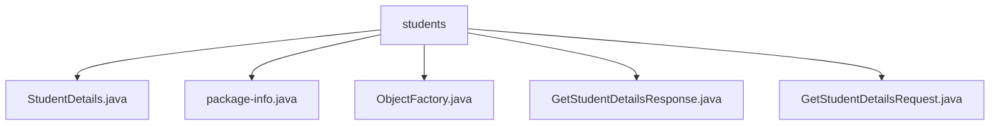

# 基础信息

|      |      |
|------|------|
| 名称 | students |
| 编码语言 | .java |
| 代码路径 | spring-boot-examples/spring-boot-tutorial-soap-web-services/src/main/java/com/in28minutes/students |
| 包名 | spring-boot-examples.spring-boot-tutorial-soap-web-services.src.main.java.com.in28minutes.students |
| 概述说明 | StudentDetails类管理学生信息，ObjectFactory简化对象创建，GetStudentDetailsResponse处理学生详情，GetStudentDetailsRequest用于获取学生信息。 |

# 说明

## 概述
该代码模块是一个基于Spring Boot的SOAP Web服务示例，主要用于管理和操作学生的基本信息。模块中包含多个类，分别负责处理学生数据的存储、请求和响应。通过SOAP协议，客户端可以请求特定学生的详细信息，服务端则返回相应的学生数据。模块的设计遵循了面向对象的原则，确保代码的可维护性和扩展性。

## 主要业务场景
1. **学生信息管理**：通过`StudentDetails`类，模块能够存储和管理学生的基本信息，包括学生的唯一标识符（ID）、姓名和护照号码。每个属性都提供了相应的getter和setter方法，方便外部访问和修改。
2. **学生信息查询**：`GetStudentDetailsRequest`类用于接收客户端发送的请求，该请求包含学生的唯一标识符（ID）。通过这个ID，服务端可以定位并返回特定学生的详细信息。
3. **学生信息响应**：`GetStudentDetailsResponse`类用于封装服务端返回的学生详细信息。该类包含一个`StudentDetails`属性，提供了获取和设置该属性的方法，确保数据的封装性和灵活性。
4. **对象创建与管理**：`ObjectFactory`类作为工厂类，负责创建和管理`com.in28minutes.students`包中的模式派生类实例。通过集中管理对象的创建逻辑，减少了代码的重复性和复杂性，提高了代码的模块化程度。

### 包内部结构视图

该流程图展示了`students`目录下的文件层级关系。`students`作为根节点，包含了`StudentDetails.java`、`package-info.java`、`ObjectFactory.java`、`GetStudentDetailsResponse.java`和`GetStudentDetailsRequest.java`五个文件。这些文件均位于`students`目录下，没有进一步的子目录结构，清晰地展示了文件与目录之间的直接关系。

# 文件列表 File List

| 名称   | 类型  | 说明 |
|-------|------|-------------|
| [GetStudentDetailsRequest.java](GetStudentDetailsRequest.md) | file | 获取学生详情请求类，包含ID属性及访问方法。 |
| [GetStudentDetailsResponse.java](GetStudentDetailsResponse.md) | file | GetStudentDetailsResponse类含StudentDetails属性及其getter和setter方法。 |
| [package-info.java](package-info.md) | file | 信息为空，无法生成概要描述。 |
| [ObjectFactory.java](ObjectFactory.md) | file | ObjectFactory类用于创建com.in28minutes.students包中的新实例。 |
| [StudentDetails.java](StudentDetails.md) | file | StudentDetails类含id、name、passportNumber属性及对应getter和setter方法。 |

