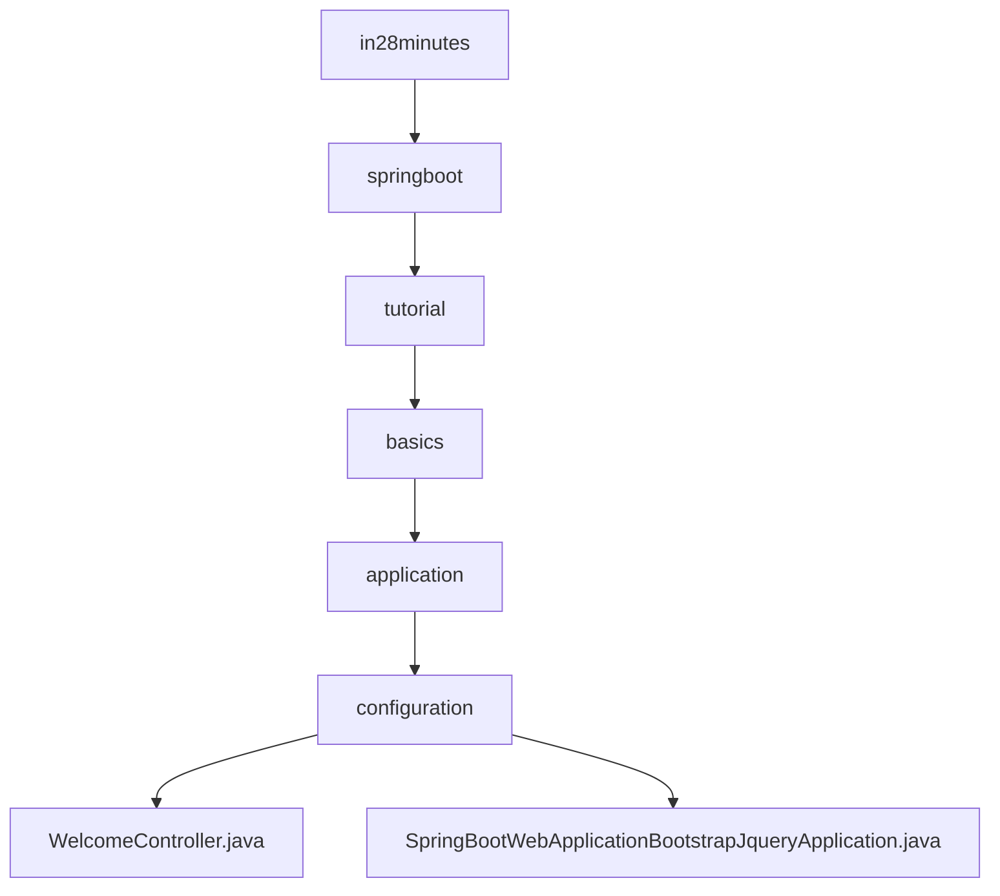

# 基础信息

|      |      |
|------|------|
| 名称 | in28minutes |
| 编码语言 | .java |
| 代码路径 | spring-boot-examples/spring-boot-web-application-bootstrap-jquery/src/main/java/com/in28minutes |
| 包名 | spring-boot-examples.spring-boot-web-application-bootstrap-jquery.src.main.java.com.in28minutes |
| 概述说明 | 欢迎控制器处理"/welcome"请求，返回"welcome"字符串。Spring Boot应用集成Bootstrap和jQuery，提升前端开发效率。 |

# 说明

## 概述
该代码模块是一个基于Spring Boot的Web应用程序，集成了Bootstrap和jQuery框架，旨在提供现代化的用户界面和高效的前端开发体验。模块包含一个欢迎控制器类和一个Spring Boot应用启动类，分别用于处理HTTP请求和初始化应用服务。

## 主要业务场景
1. **欢迎信息展示**：通过欢迎控制器类处理`/welcome`路径的HTTP请求，返回一个简单的"welcome"字符串作为响应。该功能主要用于测试应用程序的路由和控制器是否正常工作，或作为应用程序的初始端点。
2. **前端开发与布局**：集成Bootstrap框架用于前端页面的布局和样式设计，提供响应式设计和丰富的UI组件。jQuery框架简化了JavaScript操作，增强了页面的交互性和动态效果，从而提升用户体验。
3. **应用初始化与启动**：通过Spring Boot应用启动类初始化Spring Boot框架，配置相关组件，并启动应用服务。整体设计旨在提升开发效率和用户体验。

### 包内部结构视图

该流程图展示了Spring Boot示例项目中的目录结构及其层级关系。从`in28minutes`目录开始，逐步深入到`springboot`、`tutorial`、`basics`、`application`和`configuration`子目录，最终展示了两个Java文件：`WelcomeController.java`和`SpringBootWebApplicationBootstrapJqueryApplication.java`。每个节点代表路径中的最后一级元素，清晰地展示了文件与目录之间的嵌套关系。

# 文件列表 File List

| 名称   | 类型  | 说明 |
|-------|------|-------------|
| [springboot](springboot/_module.md) | package | 欢迎控制器处理"/welcome"请求，返回"welcome"字符串。Spring Boot应用集成Bootstrap和jQuery，提升前端开发效率。 |

