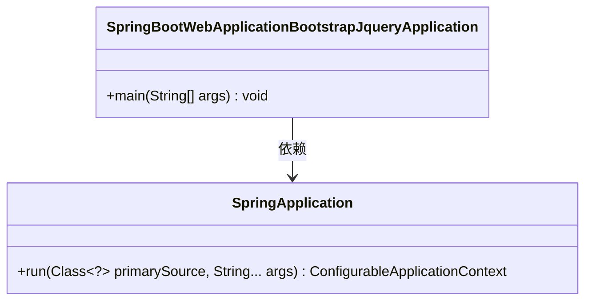
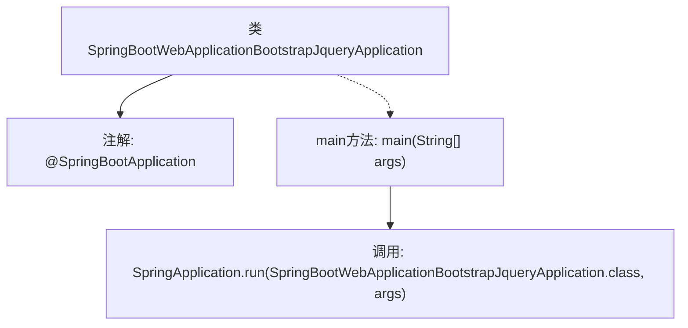

# 基础信息

|      |      |
|------|------|
| 名称 | SpringBootWebApplicationBootstrapJqueryApplication |
| 编码语言 | .java |
| 代码路径 | spring-boot-examples/spring-boot-web-application-bootstrap-jquery/src/main/java/com/in28minutes/springboot/tutorial/basics/application/configuration/SpringBootWebApplicationBootstrapJqueryApplication.java |
| 包名 | com.in28minutes.springboot.tutorial.basics.application.configuration |
| 依赖项 | ['org.springframework.boot.SpringApplication', 'org.springframework.boot.autoconfigure.SpringBootApplication'] |
| 概述说明 | Spring Boot启动类，集成Bootstrap和jQuery。 |

# 说明

Spring Boot应用启动类采用Java语言编写，集成了Bootstrap和jQuery框架。Bootstrap用于前端页面的布局和样式设计，提供响应式设计和丰富的UI组件。jQuery则简化了JavaScript操作，增强了页面的交互性和动态效果。通过集成这两个框架，应用能够实现现代化的用户界面和高效的前端开发。启动类作为应用的入口，负责初始化Spring Boot框架，配置相关组件，并启动应用服务。整体设计旨在提升开发效率和用户体验。

# 类列表 Class Summary

| 名称   | 类型  | 说明 |
|-------|------|-------------|
| SpringBootWebApplicationBootstrapJqueryApplication | class | Spring Boot应用启动类，使用Java编写，集成Bootstrap和jQuery。 |

## 类 SpringBootWebApplicationBootstrapJqueryApplication

|      |      |
|------|------|
| 访问范围 | @SpringBootApplication;public |
| 类型 | class |
| 名称 | SpringBootWebApplicationBootstrapJqueryApplication |
| 说明 | Spring Boot应用启动类，使用Java编写，集成Bootstrap和jQuery。 |

### UML类图

这段代码定义了一个Spring Boot应用程序的启动类`SpringBootWebApplicationBootstrapJqueryApplication`，其中包含一个`main`方法用于启动Spring Boot应用。`main`方法调用了`SpringApplication.run`方法，传递了当前类和一个参数数组。类图展示了`SpringBootWebApplicationBootstrapJqueryApplication`类与`SpringApplication`类之间的依赖关系，`SpringApplication`类提供了启动Spring Boot应用的核心功能。

### 内部方法调用关系图

这段代码是一个Spring Boot应用程序的启动类。通过`@SpringBootApplication`注解标记该类为Spring Boot应用的主类，`main`方法中调用`SpringApplication.run`方法来启动应用程序。流程图展示了类的结构、注解的使用以及主方法中的关键调用步骤。

### 字段列表 Field List

| 名称  | 类型  | 说明 |
|-------|-------|------|

### 方法列表 Method List

| 名称  | 类型  | 说明 |
|-------|-------|------|
| main | void | Spring Boot应用启动主方法，运行指定类。 |

