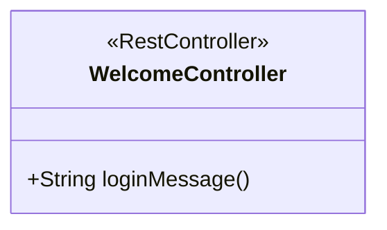
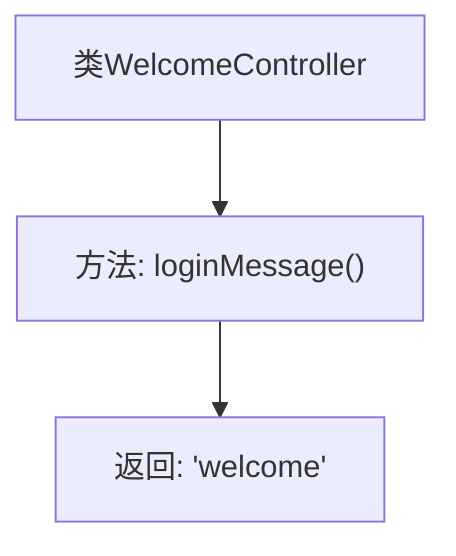

# 基础信息

|      |      |
|------|------|
| 名称 | WelcomeController |
| 编码语言 | .java |
| 代码路径 | spring-boot-examples/spring-boot-web-application-bootstrap-jquery/src/main/java/com/in28minutes/springboot/tutorial/basics/application/configuration/WelcomeController.java |
| 包名 | com.in28minutes.springboot.tutorial.basics.application.configuration |
| 依赖项 | ['org.springframework.web.bind.annotation.RequestMapping', 'org.springframework.web.bind.annotation.RestController'] |
| 概述说明 | 欢迎控制器类处理"/welcome"路径，返回"welcome"字符串。 |

# 说明

欢迎控制器类是一个用于处理HTTP请求的类，它映射了"/welcome"路径。当用户访问该路径时，控制器会返回一个简单的"welcome"字符串作为响应。这个类的主要功能是提供一个基本的欢迎信息，通常用于测试或作为应用程序的初始端点。通过这种方式，开发者可以快速验证应用程序的路由和控制器是否正常工作。

# 类列表 Class Summary

| 名称   | 类型  | 说明 |
|-------|------|-------------|
| WelcomeController | class | 欢迎控制器类，映射"/welcome"路径，返回"welcome"字符串。 |

## 类 WelcomeController

|      |      |
|------|------|
| 访问范围 | @RestController;public |
| 类型 | class |
| 名称 | WelcomeController |
| 说明 | 欢迎控制器类，映射"/welcome"路径，返回"welcome"字符串。 |

### UML类图

类图描述：`WelcomeController` 是一个使用 `@RestController` 注解的类，表示它是一个Spring MVC的控制器。该类包含一个公有方法 `loginMessage()`，该方法处理HTTP请求并返回字符串 "welcome"。这个类主要用于处理用户访问 "/welcome" 路径时的请求，并返回相应的欢迎信息。

### 内部方法调用关系图

这段代码定义了一个名为 `WelcomeController` 的 REST 控制器类，其中包含一个 `loginMessage` 方法。该方法通过 `@RequestMapping("/welcome")` 注解映射到 `/welcome` 路径，当访问该路径时，方法会返回字符串 `"welcome"`。流程图清晰地展示了类与方法之间的调用关系，以及方法的返回值。

### 字段列表 Field List

| 名称  | 类型  | 说明 |
|-------|-------|------|

### 方法列表 Method List

| 名称  | 类型  | 说明 |
|-------|-------|------|
| loginMessage | String | 定义欢迎页面的控制器方法，返回字符串"welcome"。 |

