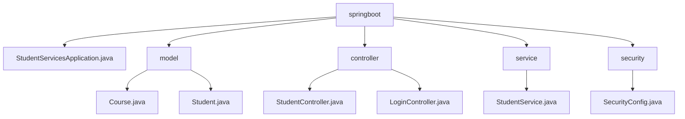

# 基础信息

|      |      |
|------|------|
| 名称 | in28minutes |
| 编码语言 | .java |
| 代码路径 | spring-boot-examples/spring-boot-web-application/src/main/java/com/in28minutes |
| 包名 | spring-boot-examples.spring-boot-web-application.src.main.java.com.in28minutes |
| 概述说明 | Spring Boot应用管理学生和课程信息，包含模型、控制器、服务和安全配置。 |

# 说明

## 概述
该代码模块是一个基于Spring Boot的Web应用程序，主要用于管理学生和课程的相关信息。模块中包含了核心模型类（`Course.java` 和 `Student.java`）、控制器类（`StudentController` 和 `LoginController`）、服务类（`StudentService`）以及安全配置类（`SecurityConfig`）。这些组件共同协作，支持学生和课程的管理、用户登录与身份验证、以及系统的安全性配置。应用程序通过Spring Boot的自动配置和依赖注入，简化了开发和部署流程，确保服务能够快速启动并运行。

## 主要业务场景
1. **学生管理**：通过`Student.java`模型类和`StudentService`服务类，系统可以管理学生的基本信息，如姓名、学号、年龄等。支持学生的注册、信息更新、查询等操作。
2. **课程管理**：通过`Course.java`模型类，系统可以管理课程的基本信息，如课程名称、课程编号、授课教师等。支持课程的创建、更新、查询等操作。
3. **学生与课程的关联**：系统支持学生选课、退课等操作，通过学生与课程之间的关联关系，实现学生课程的管理和查询。`StudentController`负责根据学生ID查询并返回相关课程信息。
4. **用户登录与身份验证**：`LoginController`负责处理用户登录请求，验证用户身份，并在成功登录后返回欢迎视图。`SecurityConfig`类配置了基于内存的用户管理和安全过滤器链，确保系统的安全性。
5. **系统安全**：`SecurityConfig`类实现了用户认证功能，并对密码进行加密处理。同时，禁用了CSRF保护和帧选项，以增强系统的安全性。

该模块适用于教育管理系统，如学校、培训机构等场景，支持学生和课程的基本操作以及用户的安全访问。

### 包内部结构视图

该流程图展示了Spring Boot项目中各模块的层级关系。`springboot`作为根节点，包含`model`、`controller`、`service`和`security`四个子模块。每个子模块下又包含具体的Java类文件，如`Course.java`、`StudentController.java`等，清晰地反映了项目结构。

# 文件列表 File List

| 名称   | 类型  | 说明 |
|-------|------|-------------|
| [springboot](springboot/_module.md) | package | Spring Boot应用管理学生和课程信息，包含模型、控制器、服务和安全配置。 |

