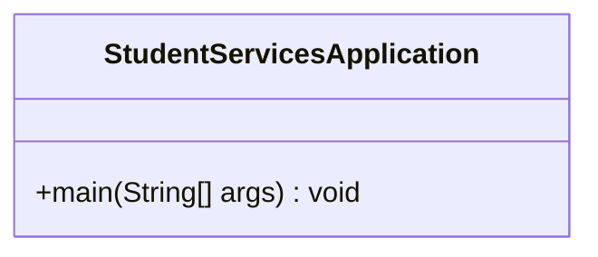
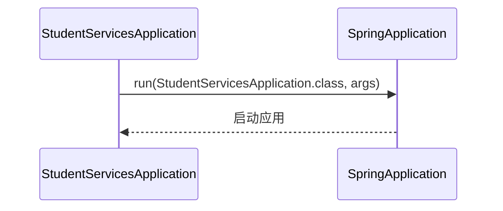
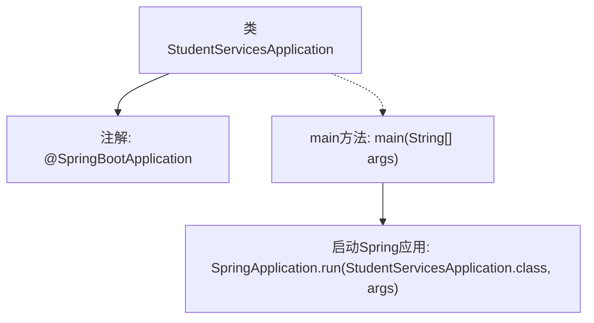

# 基础信息

|      |      |
|------|------|
| 名称 | StudentServicesApplication |
| 编码语言 | .java |
| 代码路径 | spring-boot-examples/spring-boot-web-application/src/main/java/com/in28minutes/springboot/StudentServicesApplication.java |
| 包名 | com.in28minutes.springboot |
| 依赖项 | ['org.springframework.boot.SpringApplication', 'org.springframework.boot.autoconfigure.SpringBootApplication'] |
| 概述说明 | Spring Boot类启动学生服务程序。 |

# 说明

Spring Boot应用类用于启动学生服务程序。该类作为应用程序的入口点，负责初始化Spring Boot框架并启动学生服务相关的功能。通过自动配置和依赖注入，Spring Boot简化了应用的开发和部署流程，确保学生服务能够快速启动并运行。该应用类通常包含主方法，通过调用SpringApplication.run方法来启动整个应用程序，同时加载必要的配置文件和组件，以实现学生服务的完整功能。

# 类列表 Class Summary

| 名称   | 类型  | 说明 |
|-------|------|-------------|
| StudentServicesApplication | class | Spring Boot应用类，启动学生服务程序。 |

## 类 StudentServicesApplication

|      |      |
|------|------|
| 访问范围 | @SpringBootApplication;public |
| 类型 | class |
| 名称 | StudentServicesApplication |
| 说明 | Spring Boot应用类，启动学生服务程序。 |

### UML类图

这段代码定义了一个名为 `StudentServicesApplication` 的类，它是一个Spring Boot应用的入口类。`@SpringBootApplication` 注解用于标记该类为Spring Boot应用的主配置类，并启用了自动配置和组件扫描。`main` 方法是应用的启动入口，它调用 `SpringApplication.run` 方法来启动Spring Boot应用。类图展示了 `StudentServicesApplication` 类的结构，时序图则描述了应用启动时 `StudentServicesApplication` 与 `SpringApplication` 之间的交互过程。

### 内部方法调用关系图

这段代码定义了一个名为`StudentServicesApplication`的类，并使用`@SpringBootApplication`注解标记该类为Spring Boot应用的入口。`main`方法是程序的启动点，它通过调用`SpringApplication.run`方法来启动Spring应用。该流程展示了Spring Boot应用的初始化过程，从类的定义到应用的启动，简洁明了。

### 字段列表 Field List

| 名称  | 类型  | 说明 |
|-------|-------|------|

### 方法列表 Method List

| 名称  | 类型  | 说明 |
|-------|-------|------|
| main | void | Spring应用启动类，运行学生服务程序。 |

