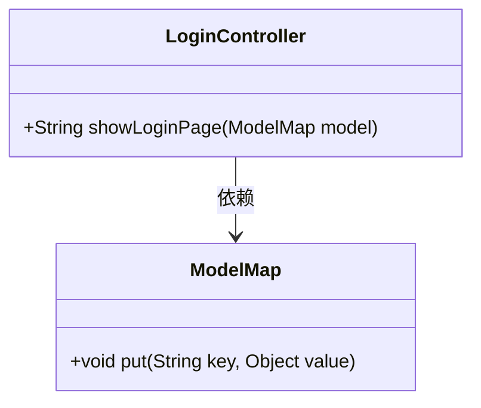
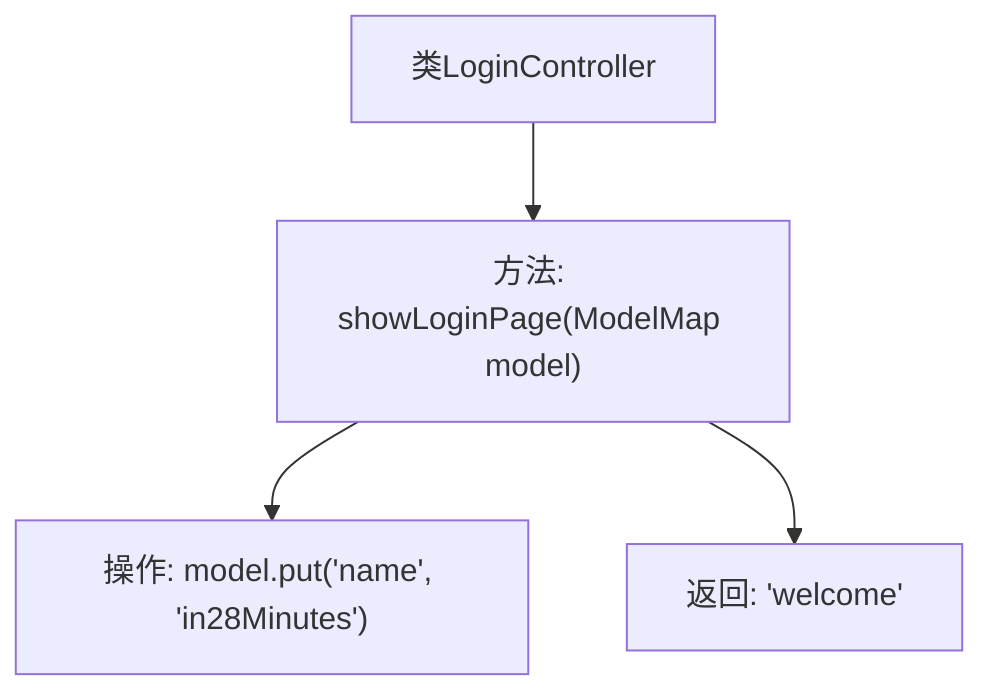

# 基础信息

|      |      |
|------|------|
| 名称 | LoginController |
| 编码语言 | .java |
| 代码路径 | spring-boot-examples/spring-boot-web-application/src/main/java/com/in28minutes/springboot/controller/LoginController.java |
| 包名 | com.in28minutes.springboot.controller |
| 依赖项 | ['org.springframework.ui.ModelMap', 'org.springframework.web.bind.annotation.GetMapping', 'org.springframework.web.bind.annotation.RestController'] |
| 概述说明 | LoginController类负责展示登录页面并返回欢迎视图。 |

# 说明

LoginController类负责展示登录页面，并在用户成功登录后返回欢迎视图。该类的主要功能是处理用户登录请求，验证用户身份，并在验证通过后将用户重定向到欢迎页面。通过这种方式，LoginController确保了用户能够顺利进入系统并访问其个人化的欢迎界面。

# 类列表 Class Summary

| 名称   | 类型  | 说明 |
|-------|------|-------------|
| LoginController | class | LoginController类展示登录页面，返回欢迎视图。 |

## 类 LoginController

|      |      |
|------|------|
| 访问范围 | @RestController;public |
| 类型 | class |
| 名称 | LoginController |
| 说明 | LoginController类展示登录页面，返回欢迎视图。 |

### UML类图

**描述：**  
该代码定义了一个名为 `LoginController` 的类，它是一个Spring MVC的控制器，用于处理登录页面的请求。`LoginController` 类中有一个公有方法 `showLoginPage`，该方法接收一个 `ModelMap` 类型的参数，并将字符串 "in28Minutes" 放入 `ModelMap` 中，最后返回视图名称 "welcome"。`ModelMap` 类提供了 `put` 方法，用于将键值对存储到模型中。`LoginController` 依赖于 `ModelMap` 来传递数据到视图层。

### 内部方法调用关系图

这段代码定义了一个名为 `LoginController` 的 Spring Boot 控制器类。该类包含一个 `showLoginPage` 方法，该方法通过 `@GetMapping` 注解映射到根路径 ("/")。在方法内部，它将一个键值对 ("name", "in28Minutes") 放入 `ModelMap` 对象中，并返回字符串 "welcome"。该流程展示了如何通过控制器方法处理 HTTP GET 请求，并将数据传递给视图层。

### 字段列表 Field List

| 名称  | 类型  | 说明 |
|-------|-------|------|

### 方法列表 Method List

| 名称  | 类型  | 说明 |
|-------|-------|------|
| showLoginPage | String | 该方法映射根路径，返回欢迎页面并传递名称参数。 |

