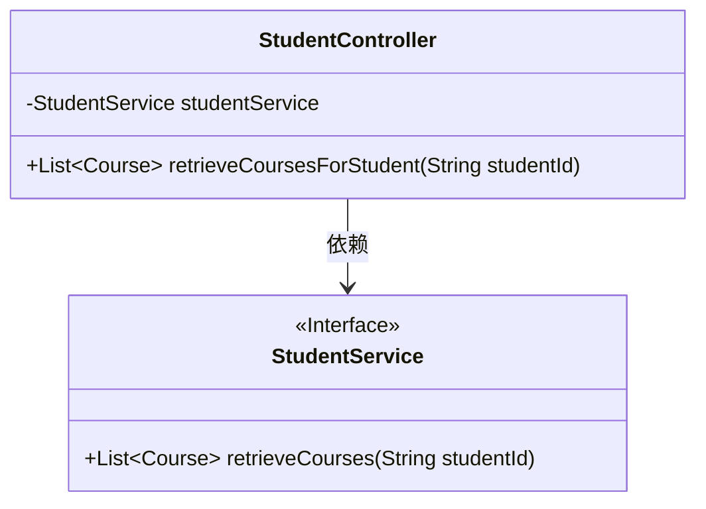
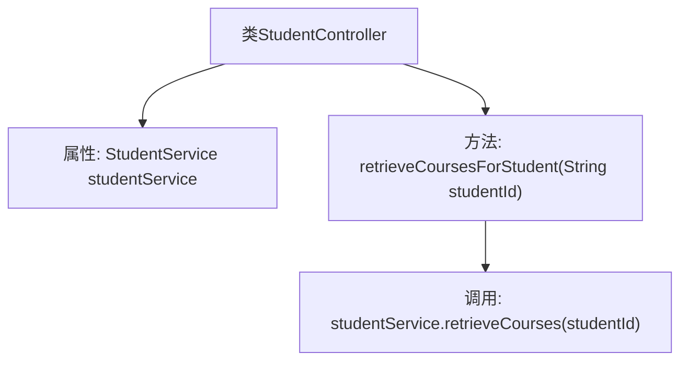
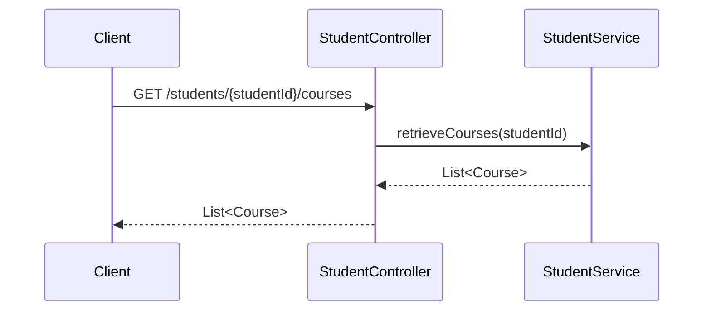

# 基础信息

|      |      |
|------|------|
| 名称 | StudentController |
| 编码语言 | .java |
| 代码路径 | spring-boot-examples/spring-boot-web-application/src/main/java/com/in28minutes/springboot/controller/StudentController.java |
| 包名 | com.in28minutes.springboot.controller |
| 依赖项 | ['java.util.List', 'org.springframework.beans.factory.annotation.Autowired', 'org.springframework.web.bind.annotation.GetMapping', 'org.springframework.web.bind.annotation.PathVariable', 'org.springframework.web.bind.annotation.RestController', 'com.in28minutes.springboot.model.Course', 'com.in28minutes.springboot.service.StudentService'] |
| 概述说明 | 学生控制器按ID查询学生课程列表。 |

# 说明

学生控制器负责根据学生ID获取该学生的课程列表。该功能通过接收学生ID作为输入，查询相关数据源，返回与该学生关联的所有课程信息。此过程确保了数据准确性和查询效率，支持学生快速访问其课程信息。

# 类列表 Class Summary

| 名称   | 类型  | 说明 |
|-------|------|-------------|
| StudentController | class | 学生控制器通过ID获取学生课程列表。 |

## 类 StudentController

|      |      |
|------|------|
| 访问范围 | @RestController;public |
| 类型 | class |
| 名称 | StudentController |
| 说明 | 学生控制器通过ID获取学生课程列表。 |

### UML类图

这段代码定义了一个 `StudentController` 类，该类通过 `@Autowired` 注解注入了一个 `StudentService` 接口的实例。`StudentController` 类包含一个 `retrieveCoursesForStudent` 方法，该方法通过 HTTP GET 请求获取指定学生的课程列表。`StudentService` 接口定义了一个 `retrieveCourses` 方法，用于从数据源中检索课程信息。`StudentController` 依赖于 `StudentService` 来实现其功能。

### 内部方法调用关系图

这段代码定义了一个Spring Boot的`StudentController`类，用于处理学生课程信息的请求。类中包含一个`StudentService`的依赖注入，并通过`retrieveCoursesForStudent`方法根据学生ID获取课程列表。流程图展示了类的结构和方法的调用关系，时序图则详细描述了请求从客户端到控制器再到服务层的处理流程。

### 字段列表 Field List

| 名称  | 类型  | 说明 |
|-------|-------|------|
| studentService | StudentService | 自动注入StudentService实例。 |

### 方法列表 Method List

| 名称  | 类型  | 说明 |
|-------|-------|------|
| retrieveCoursesForStudent | List<Course> | 通过学生ID获取其课程列表的API接口。 |

