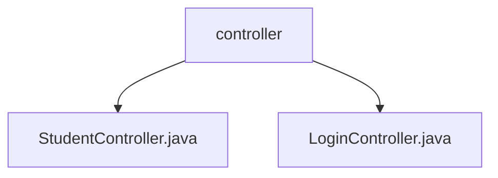

# 基础信息

|      |      |
|------|------|
| 名称 | controller |
| 编码语言 | .java |
| 代码路径 | spring-boot-examples/spring-boot-web-application/src/main/java/com/in28minutes/springboot/controller |
| 包名 | spring-boot-examples.spring-boot-web-application.src.main.java.com.in28minutes.springboot.controller |
| 概述说明 | 学生控制器获取课程列表，登录控制器处理登录请求并重定向。 |

# 说明

## 概述

该代码模块是一个基于Spring Boot的Web应用程序，主要包含两个控制器类：`StudentController`和`LoginController`。`StudentController`负责根据学生ID获取该学生的课程列表，而`LoginController`则负责处理用户登录请求，验证用户身份，并在成功登录后返回欢迎视图。这两个控制器共同协作，确保用户能够顺利访问系统并获取个性化的课程信息。

## 主要业务场景

1. **学生课程信息查询**：`StudentController`接收学生ID作为输入，查询相关数据源，返回与该学生关联的所有课程信息。此功能确保了学生能够快速、准确地访问其课程信息，提高了数据查询的效率。

2. **用户登录与身份验证**：`LoginController`负责展示登录页面，并在用户成功登录后返回欢迎视图。该控制器处理用户登录请求，验证用户身份，并在验证通过后将用户重定向到欢迎页面。通过这种方式，`LoginController`确保了用户能够顺利进入系统并访问其个人化的欢迎界面。

### 包内部结构视图

该流程图展示了Spring Boot Web应用程序中控制器的结构。`controller`文件夹包含两个控制器文件：`StudentController.java`和`LoginController.java`。这些控制器分别处理学生和登录相关的请求，展示了典型的MVC架构中控制器的层级关系。

# 文件列表 File List

| 名称   | 类型  | 说明 |
|-------|------|-------------|
| [StudentController.java](StudentController.md) | file | 学生控制器按ID查询学生课程列表。 |
| [LoginController.java](LoginController.md) | file | LoginController类负责展示登录页面并返回欢迎视图。 |

