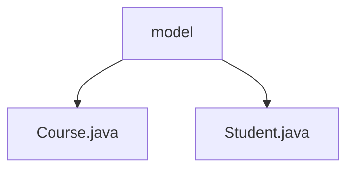

# 基础信息

|      |      |
|------|------|
| 名称 | model |
| 编码语言 | .java |
| 代码路径 | spring-boot-examples/spring-boot-web-application/src/main/java/com/in28minutes/springboot/model |
| 包名 | spring-boot-examples.spring-boot-web-application.src.main.java.com.in28minutes.springboot.model |
| 概述说明 | 未提供具体内容，无法总结。 |

# 说明

## 概述
该代码模块是一个基于Spring Boot的Web应用程序，主要用于管理学生和课程的相关信息。模块中包含了两个核心模型类：`Course.java` 和 `Student.java`，分别用于表示课程和学生的实体。这些模型类可能用于存储、处理和展示与学生和课程相关的数据。

## 主要业务场景
1. **学生管理**：通过`Student.java`类，系统可以管理学生的基本信息，如姓名、学号、年龄等。可能的业务场景包括学生的注册、信息更新、查询等操作。
2. **课程管理**：通过`Course.java`类，系统可以管理课程的基本信息，如课程名称、课程编号、授课教师等。可能的业务场景包括课程的创建、更新、查询等操作。
3. **学生与课程的关联**：系统可能支持学生选课、退课等操作，通过学生与课程之间的关联关系，实现学生课程的管理和查询。

该模块通过这些模型类，支持在教育管理系统中进行学生和课程的基本操作，可能应用于学校、培训机构等场景。

### 包内部结构视图

该流程图展示了 `spring-boot-web-application` 项目中 `model` 目录下的文件结构。`model` 目录包含两个 Java 文件：`Course.java` 和 `Student.java`。这些文件分别代表课程和学生模型，用于在 Spring Boot 应用中管理和操作相关数据。

# 文件列表 File List

| 名称   | 类型  | 说明 |
|-------|------|-------------|
| [Student.java](Student.md) | file | 无内容，无法生成概要描述。 |
| [Course.java](Course.md) | file | 信息为空，无法生成概要描述。 |

