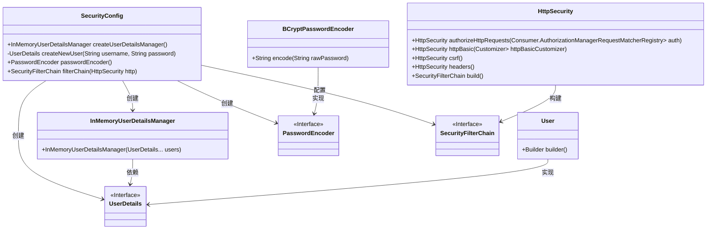

# 基础信息

|      |      |
|------|------|
| 名称 | SecurityConfig |
| 编码语言 | .java |
| 代码路径 | spring-boot-examples/spring-boot-web-application/src/main/java/com/in28minutes/springboot/security/SecurityConfig.java |
| 包名 | com.in28minutes.springboot.security |
| 依赖项 | ['org.springframework.security.config.Customizer.withDefaults', 'java.util.function.Function', 'org.springframework.context.annotation.Bean', 'org.springframework.context.annotation.Configuration', 'org.springframework.security.config.annotation.web.builders.HttpSecurity', 'org.springframework.security.core.userdetails.User', 'org.springframework.security.core.userdetails.UserDetails', 'org.springframework.security.crypto.bcrypt.BCryptPasswordEncoder', 'org.springframework.security.crypto.password.PasswordEncoder', 'org.springframework.security.provisioning.InMemoryUserDetailsManager', 'org.springframework.security.web.SecurityFilterChain'] |
| 概述说明 | SecurityConfig类配置用户认证、密码加密，禁用CSRF和帧选项。 |

# 说明

SecurityConfig类负责配置基于内存的用户管理和安全过滤器链，实现了用户认证功能，并对密码进行加密处理。同时，该类禁用了CSRF保护和帧选项，以确保系统的安全性。

# 类列表 Class Summary

| 名称   | 类型  | 说明 |
|-------|------|-------------|
| SecurityConfig | class | SecurityConfig类配置了基于内存的用户管理和安全过滤器链，支持用户认证、密码加密，并禁用CSRF和帧选项。 |

## 类 SecurityConfig

|      |      |
|------|------|
| 访问范围 | @Configuration;public |
| 类型 | class |
| 名称 | SecurityConfig |
| 说明 | SecurityConfig类配置了基于内存的用户管理和安全过滤器链，支持用户认证、密码加密，并禁用CSRF和帧选项。 |

### UML类图

这段代码定义了一个Spring Security配置类`SecurityConfig`，用于配置用户认证和授权。`SecurityConfig`类通过`InMemoryUserDetailsManager`创建内存用户，并使用`BCryptPasswordEncoder`进行密码加密。它还配置了`SecurityFilterChain`来保护所有URL，并禁用CSRF保护和帧选项。类图中展示了各个类之间的关系和依赖，包括接口的实现和类的创建过程。

### 内部方法调用关系图

这段代码定义了一个Spring Security配置类`SecurityConfig`，用于配置应用程序的安全策略。它通过`createUserDetailsManager`方法创建了一个内存用户管理器，并通过`createNewUser`方法创建用户。`passwordEncoder`方法返回一个BCrypt密码编码器。`filterChain`方法配置了HTTP安全策略，包括认证、CSRF保护和Frame选项的禁用。这些配置确保了应用程序的安全性，同时提供了基本的用户认证和授权功能。

### 字段列表 Field List

| 名称  | 类型  | 说明 |
|-------|-------|------|

### 方法列表 Method List

| 名称  | 类型  | 说明 |
|-------|-------|------|
| createUserDetailsManager | InMemoryUserDetailsManager | 创建内存用户管理器，包含用户admin1和密码secret1。 |
| createNewUser | UserDetails | 创建新用户方法，编码密码并设置用户名、密码及角色。 |
| passwordEncoder | PasswordEncoder | 定义一个Bean方法，返回BCryptPasswordEncoder实例。 |
| filterChain | SecurityFilterChain | 配置安全过滤器链，要求所有请求认证，启用HTTP基本认证，禁用CSRF和帧选项。 |

