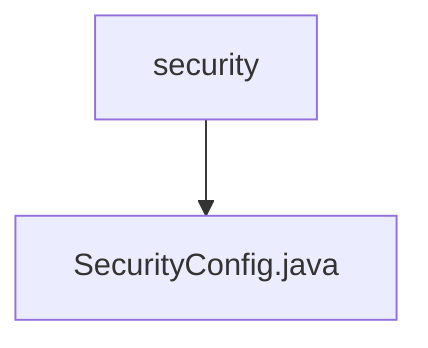

# 基础信息

|      |      |
|------|------|
| 名称 | security |
| 编码语言 | .java |
| 代码路径 | spring-boot-examples/spring-boot-web-application/src/main/java/com/in28minutes/springboot/security |
| 包名 | spring-boot-examples.spring-boot-web-application.src.main.java.com.in28minutes.springboot.security |
| 概述说明 | SecurityConfig类配置用户认证、密码加密，禁用CSRF和帧选项。 |

# 说明

SecurityConfig类负责配置基于内存的用户管理和安全过滤器链，实现了用户认证功能，并对密码进行加密处理。同时，该类禁用了CSRF保护和帧选项，以确保系统的安全性。

### 包内部结构视图

该流程图展示了`security`文件夹与其子文件`SecurityConfig.java`之间的层级关系。`security`是父节点，`SecurityConfig.java`是其唯一的子节点，表示该文件夹中仅包含一个配置文件。

# 文件列表 File List

| 名称   | 类型  | 说明 |
|-------|------|-------------|
| [SecurityConfig.java](SecurityConfig.md) | file | SecurityConfig类配置用户认证、密码加密，禁用CSRF和帧选项。 |

