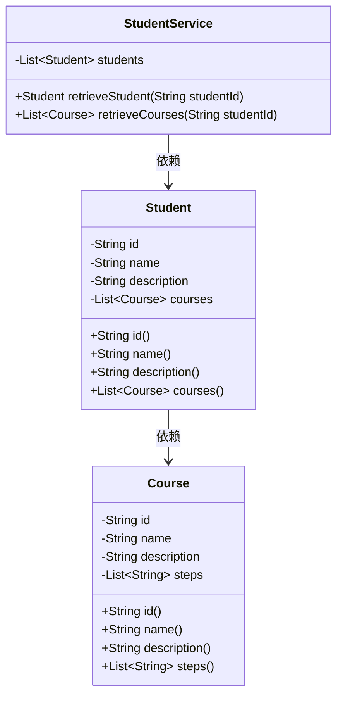
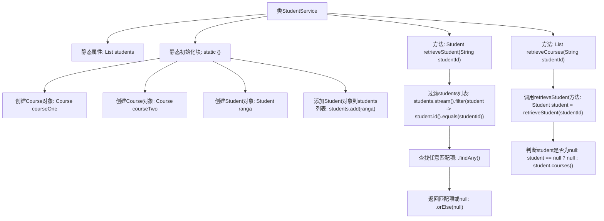

# 基础信息

|      |      |
|------|------|
| 名称 | StudentService |
| 编码语言 | .java |
| 代码路径 | spring-boot-examples/spring-boot-web-application/src/main/java/com/in28minutes/springboot/service/StudentService.java |
| 包名 | com.in28minutes.springboot.service |
| 依赖项 | ['java.util.ArrayList', 'java.util.List', 'com.in28minutes.springboot.model.Course', 'com.in28minutes.springboot.model.Student', 'org.springframework.stereotype.Service'] |
| 概述说明 | StudentService类负责学生数据管理，支持ID查询学生及课程信息。 |

# 说明

StudentService类负责管理学生数据，主要功能包括根据学生ID查询学生信息和相关课程信息。该类通过高效的数据管理，确保能够快速准确地获取所需的学生和课程数据，满足系统对学生信息查询的需求。

# 类列表 Class Summary

| 名称   | 类型  | 说明 |
|-------|------|-------------|
| StudentService | class | StudentService类管理学生数据，提供根据ID查询学生和课程的功能。 |

## 类 StudentService

|      |      |
|------|------|
| 访问范围 | @Service;public |
| 类型 | class |
| 名称 | StudentService |
| 说明 | StudentService类管理学生数据，提供根据ID查询学生和课程的功能。 |

### UML类图

**描述：**  
`StudentService` 类负责管理学生数据，包含一个静态的 `students` 列表，初始化时添加了一个学生及其课程信息。该类提供了两个公有方法：`retrieveStudent` 用于根据学生ID查找学生，`retrieveCourses` 用于获取指定学生的课程列表。`Student` 类表示学生实体，包含学生的ID、姓名、描述和课程列表。`Course` 类表示课程实体，包含课程的ID、名称、描述和步骤列表。`StudentService` 依赖 `Student`，而 `Student` 又依赖 `Course`，形成了类之间的依赖关系。

### 内部方法调用关系图

**描述**：  
该代码定义了一个`StudentService`类，用于管理学生数据。类中包含一个静态的`students`列表，在静态初始化块中初始化了两个`Course`对象和一个`Student`对象，并将学生对象添加到列表中。类提供了两个方法：`retrieveStudent`用于根据学生ID查找学生，`retrieveCourses`用于根据学生ID查找该学生的课程列表。流程图展示了类的初始化过程以及方法之间的调用关系。

### 字段列表 Field List

| 名称  | 类型  | 说明 |
|-------|-------|------|
| students = new ArrayList<>() | List<Student> | 定义一个私有的静态学生列表变量。 |

### 方法列表 Method List

| 名称  | 类型  | 说明 |
|-------|-------|------|
| retrieveStudent | Student | 通过ID从学生列表中检索并返回对应学生对象。 |
| retrieveCourses | List<Course> | 通过学生ID检索课程列表，若学生不存在则返回空。 |

