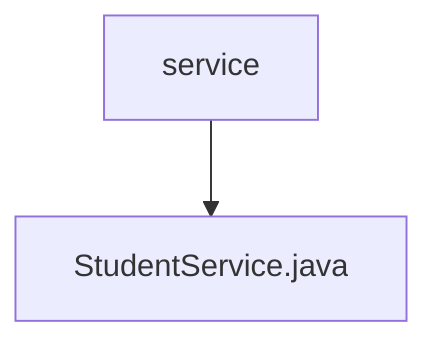

# 基础信息

|      |      |
|------|------|
| 名称 | service |
| 编码语言 | .java |
| 代码路径 | spring-boot-examples/spring-boot-web-application/src/main/java/com/in28minutes/springboot/service |
| 包名 | spring-boot-examples.spring-boot-web-application.src.main.java.com.in28minutes.springboot.service |
| 概述说明 | StudentService类负责学生数据管理，支持ID查询学生及课程信息。 |

# 说明

StudentService类负责管理学生数据，主要功能包括根据学生ID查询学生信息和相关课程信息。该类通过高效的数据管理，确保能够快速准确地获取所需的学生和课程数据，满足系统对学生信息查询的需求。

### 包内部结构视图

该流程图展示了`spring-boot-web-application`项目中`service`目录下的层级关系。`service`目录包含一个名为`StudentService.java`的文件，表示这是一个服务类，可能用于处理与学生相关的业务逻辑。整个结构简洁明了，符合典型的Spring Boot项目目录布局。

# 文件列表 File List

| 名称   | 类型  | 说明 |
|-------|------|-------------|
| [StudentService.java](StudentService.md) | file | StudentService类负责学生数据管理，支持ID查询学生及课程信息。 |

